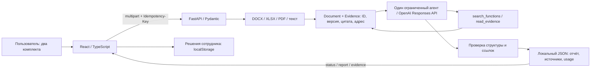

# Kontur — organizational intelligence

**Kontur** — прототип команды **Amazing Guys** для HackAlem: сравнение организационных документов **до и после реорганизации** с прослеживаемостью выводов до исходных фрагментов. Пользователь — сотрудник, который проверяет изменения подразделений, обязанностей и зон ответственности.

Вместо ручного поиска по двум редакциям пользователь получает изменения подразделений, матрицу функций, замечания, цитаты и аналитическое заключение. Решение помогает подготовить проверку; окончательную оценку принимает сотрудник. Экономия времени относительно ручной работы отдельно не измерялась.

Этот файл — общая точка входа в репозиторий и ветку `main`. Подробности реализации: [backend](backend/README.md), [frontend](frontend/README.md), [Docker](deploy/README.md). Документация товарища по коду `b0523fd` дополнена проверенной Docker-упаковкой и актуальными ограничениями **23 сентября 2026 года**.

## Содержание

- [Что реализовано](#что-реализовано)
- [Быстрый запуск](#быстрый-запуск)
- [Как проверить основной сценарий](#как-проверить-основной-сценарий)
- [Архитектура и взаимодействие](#архитектура-и-взаимодействие)
- [Технологии и их назначение](#технологии-и-их-назначение)
- [Данные и состояние](#данные-и-состояние)
- [Оценка хакатона](#оценка-хакатона)
- [Проверки и измеренный результат](#проверки-и-измеренный-результат)
- [Ограничения и безопасность](#ограничения-и-безопасность)
- [Как ориентироваться в репозитории](#как-ориентироваться-в-репозитории)
- [Командная работа и развитие](#командная-работа-и-развитие)

## Что реализовано

| Возможность                 | Как работает и где находится                                                                                               |
| --------------------------- | -------------------------------------------------------------------------------------------------------------------------- |
| Загрузка двух комплектов    | DOCX, текстовый PDF, XLSX, TXT, MD; выбор или перетаскивание, проверка размера/количества, удаление файлов                 |
| Изменения подразделений     | Сохранение, переименование, создание, упразднение, объединение, разделение или неопределённая связь; раздел «Сравнение»    |
| Матрица функций             | Сохранённые, переданные, изменённые и несопоставленные функции; отдельно реестр извлечённых функций                        |
| Замечания                   | Возможная потеря, дублирование, потенциальный конфликт интересов и недостаток данных; тип, объяснение, охват и ограничения |
| Проверяемые источники       | Файл, версия, адрес, дословная извлечённая цитата и соседний контекст; панель открывается из строки/замечания              |
| Сравнение цитат рядом       | Две колонки «до/после»; для одной короткой цитаты с каждой стороны — подсветка различий текста                             |
| Заключение                  | Сводка, ограничения, рекомендации со ссылками на замечания и источники, журнал операций                                    |
| Решение сотрудника          | «Не проверено», «Подтверждено», «Отклонено», «Нужно уточнение», комментарий, сброс и сводка; хранение только в браузере    |
| Экспорт                     | JSON отчёта с признаком происхождения; локальные решения сотрудника в файл не входят                                       |
| Гостевой вход               | Кнопка «Войти» → «Войти как гость»; локальное состояние интерфейса без регистрации и серверной аутентификации              |
| Обработка ожидания и ошибок | Спиннеры, этапы сервера, ошибки чтения, повтор, прекращение ожидания; защита от повторных нажатий                          |
| Демо без сервера            | Авторские данные, PDF-исходники, полный/частичный/пустой/ошибочный сценарии; модель не вызывается                          |
| Адаптивность                | Мобильное меню, таблицы с собственной прокруткой, фокус клавиатуры, подписи состояний и reduced motion                     |

Наличие категории в схеме не означает, что модель правильно распознает любой случай этой категории. `completed` означает завершение обработки; `coverage=complete` относится к чтению предоставленных документов, а не к обнаружению всех изменений.

## Быстрый запуск

### Требования

| Режим                               | Что требуется                                                                                                     |
| ----------------------------------- | ----------------------------------------------------------------------------------------------------------------- |
| Только интерфейс и авторский пример | Git, Node.js **22.12+**, npm                                                                                      |
| Анализ собственных документов       | Дополнительно `uv`, Python **3.11–3.13** (для воспроизведения используется 3.12), доступ к OpenAI API и свой ключ |
| Браузерные тесты                    | Chromium для Playwright либо установленный Google Chrome                                                          |
| Запуск всего приложения в Docker    | Git, Docker Desktop с Linux Engine или Docker Engine + Compose; для анализа — собственный OpenAI API key. Python и Node на хосте не нужны |

Сеть нужна для первой установки зависимостей и реального анализа. После установки демо работает локально. Отдельные БД, Docker, GPU и NVIDIA-сервисы для текущей реализации не нужны. Зависимости закреплены в `backend/uv.lock` и `frontend/package-lock.json`.

```sh
git clone https://github.com/BAITC-Hacks/hack-1086dac4-amazing-guys.git
cd hack-1086dac4-amazing-guys
```

### Вариант 0: всё приложение в Docker

Запустите Docker Desktop (Linux containers). Создайте `.env` в корне, сохранив существующий файл:

```powershell
# Windows PowerShell
if (!(Test-Path .env)) { Copy-Item .env.example .env }
```

```sh
# macOS / Linux
test -f .env || cp .env.example .env
```

Для настоящего анализа заполните `OPENAI_API_KEY` в `.env`. Модель по умолчанию — `gpt-6-luna`, reasoning — `medium`. Пустой ключ допустим для авторского демо, но загруженные файлы без ключа не анализируются.

```sh
docker compose up -d --build --wait
docker compose ps
```

Откройте **[http://localhost:8080](http://localhost:8080)**. Оба сервиса должны быть `healthy`. Frontend и `/api/` работают через один Nginx; отдельный запуск Python, Vite и настройка CORS не нужны. Healthcheck проверяет приложение, а не доступность платной модели.

Для быстрой проверки выберите «Сервер», загрузите [before.docx](fixtures/quick-check/before.docx) в «До» и [after.docx](fixtures/quick-check/after.docx) в «После». Ожидается одно возможное дублирование ведения реестра. Затем проверьте «Сравнить цитаты рядом» и сохранение решения сотрудника. Это авторский короткий пример; результат нового анализа может отличаться. Инструкции с ожидаемым ответом модели не загружайте.

```sh
# Автоматические backend-тесты, без ключа и платных запросов
docker compose --profile checks run --build --rm backend-tests
# Диагностика
docker compose logs --tail 100 backend web
# Остановка с сохранением отчётов
docker compose down
# Повторный запуск
docker compose up -d --wait
```

После обновления кода или ключа: `docker compose up -d --build --force-recreate --wait`. Не перезапускайте backend во время нужного анализа. Если порт занят, добавьте `KONTUR_PORT=8081` в `.env`, повторите запуск и откройте порт 8081.

Отчёты хранятся в Docker-томе `kontur_analysis-data`; `down` сохраняет его, `down --volumes` удаляет. Решения сотрудника остаются в браузере и не входят в JSON-экспорт. Они привязаны к адресу сайта: данные на `127.0.0.1:4173`, `localhost:8080` и `127.0.0.1:8080` различаются. Ключ подключается при запуске, не встраивается в образы. Порт опубликован только на `127.0.0.1`; пользовательской авторизации нет.

Полная инструкция, устройство контейнеров и устранение ошибок: **[deploy/README.md](deploy/README.md)**. Проверки упаковки: [журнал Docker](docs/DOCKER_VERIFICATION.md).

### Вариант 1: посмотреть интерфейс без ключей

Из корня проекта:

```sh
cd frontend
npm ci
npm run dev
```

Откройте [http://127.0.0.1:5173](http://127.0.0.1:5173). Нажмите **«Открыть пример»** или выберите раздел слева. Это заранее подготовленный авторский пример: выбранные вами файлы в режиме «Демо» не анализируются и не отправляются на сервер.

### Вариант 2: подключить настоящий анализ

Первый терминал, **корень репозитория**:

```sh
uv sync --project backend --locked --python 3.12
```

Создайте корневой `.env` по `.env.example`, сохранив существующий файл. На macOS/Linux:

```sh
test -f .env || cp .env.example .env
```

На Windows PowerShell:

```powershell
if (!(Test-Path .env)) { Copy-Item .env.example .env }
```

Откройте `.env` в редакторе и заполните `OPENAI_API_KEY`. Остальные исходные значения:

```dotenv
OPENAI_MODEL=gpt-6-luna
OPENAI_REASONING_EFFORT=medium
CORS_ORIGINS=
```

Ключ читается **только из `.env` в корне**, а не из `frontend/.env.local` и не из унаследованной переменной `OPENAI_API_KEY` процесса. Он остаётся на сервере и не должен попадать в `VITE_*`.

```sh
uv run --project backend --locked uvicorn backend.app:app --host 127.0.0.1 --port 8000
```

Запускайте **один worker**. В другом терминале из корня выполните `cd frontend`, `npm ci`, `npm run dev`. Адрес API по умолчанию — `http://127.0.0.1:8000`; при необходимости создайте `frontend/.env.local` из [примера](frontend/.env.example), задайте `VITE_API_BASE_URL` и перезапустите Vite.

| Адрес                                                             | Назначение                                                                                        |
| ----------------------------------------------------------------- | ------------------------------------------------------------------------------------------------- |
| [127.0.0.1:5173](http://127.0.0.1:5173)                           | Основной интерфейс разработки                                                                     |
| [127.0.0.1:8000/api/health](http://127.0.0.1:8000/api/health)     | Доступность и наличие настройки модели; не вызывает модель и не проверяет баланс/валидность ключа |
| [127.0.0.1:8000/docs](http://127.0.0.1:8000/docs)                 | Интерактивная документация FastAPI                                                                |
| [127.0.0.1:8000/openapi.json](http://127.0.0.1:8000/openapi.json) | Машиночитаемая схема API                                                                          |
| [127.0.0.1:8000](http://127.0.0.1:8000)                           | Упрощённый технический UI; основной демонстрационный интерфейс находится на 5173                  |

В `frontend/` команда `npm run build` проверяет TypeScript и создаёт `dist/`; `npm run preview` показывает эту сборку на [127.0.0.1:4173](http://127.0.0.1:4173). Preview служит локальной проверкой сборки. Публичное развёртывание, TLS и многопользовательский доступ не настроены.

### Частые проблемы запуска

| Симптом                           | Что проверить                                                                                                     |
| --------------------------------- | ----------------------------------------------------------------------------------------------------------------- |
| `ModuleNotFoundError: backend`    | Запускайте сервер из корня с `--project backend`                                                                  |
| `model_configured: false` или 503 | Заполнен ли корневой `.env`; после изменения нужен перезапуск backend                                             |
| «Сервер не ответил»               | Запущен ли backend; верен ли `VITE_API_BASE_URL`; совпадают ли схема, адрес и CORS                                |
| Порт 5173/4173 занят              | Остановите предыдущий Vite/preview: включён `strictPort`, автоматического перехода на другой порт нет             |
| Кнопка сравнения недоступна       | Выбран ли «Сервер», есть ли хотя бы один допустимый файл с каждой стороны, закончилась ли локальная подготовка    |
| 429                               | Уже есть два незавершённых задания; дождитесь обработки                                                           |
| Анализ завершился ошибкой         | Прочитайте безопасное сообщение; при `failed` новый запуск использует новый ключ. Не заменяйте ошибку демоотчётом |
| PDF прочитан частично             | Нужен текстовый слой; OCR отсутствует, предупреждения доступны в разделе «Документы»                              |

## Как проверить основной сценарий

### Демонстрация интерфейса

1. Откройте пример: в строке документов должны появиться `before.pdf` и `after.pdf`.
2. В «Сравнении» переключите матрицу функций, подразделения и реестр; проверьте поиск и фильтр.
3. Откройте источники строки, затем **«Сравнить цитаты рядом»**. Сопоставьте цитаты с контекстом: подсветка показывает текстовые различия, а не доказанную смысловую ошибку.
4. В «Замечаниях» нажмите **«Проверить основания»**, выберите решение, добавьте комментарий и сохраните. Сводка должна измениться; модельный ответ остаётся прежним.
5. Откройте заключение и скачайте JSON. Исходные демонстрационные PDF и экспорт JSON — разные артефакты.

### Проверка модели на контрольных документах

1. Запустите backend с ключом и выберите **«Сервер»**.
2. В «До» загрузите [fixtures/org-review/before.md](fixtures/org-review/before.md), в «После» — [after.md](fixtures/org-review/after.md).
3. Нажмите **«Сравнить документы»**. Извлечённый текст будет передан OpenAI; запросы оплачиваются аккаунтом владельца ключа. Это отдельный запуск, не повтор готового демо.
4. Дождитесь отчёта, проверьте предупреждения чтения, замечания и точные цитаты.
5. Сравните результат с [пятью контрольными случаями](fixtures/org-review/README.md). **`expected.json` модели не передаётся**.

Для проверки PDF-пути можно загрузить `frontend/public/demo/before.pdf` и `after.pdf`. Их текст основан на том же авторском комплекте, но извлечение и адреса PDF отличаются от Markdown; исторические метрики Markdown автоматически на PDF не переносятся.

При сбое установки соединения с моделью backend допускает одну повторную попытку за анализ. Обрыв уже получаемого ответа автоматически не повторяется: запрос мог быть обработан и оплачен. Пользователь получает различимые сообщения и возможность ручного повтора; неизвестный расход остаётся неизвестным. `/api/health` не проверяет доступность API модели.

«Остановить ожидание» прерывает запросы браузера, а не серверную задачу. Повтор с тем же известным ID продолжает ожидание. Перезагрузка страницы очищает файлы и отчёт из памяти интерфейса; сохранённый на backend результат остаётся доступен по ID через API.

## Архитектура и взаимодействие



1. Frontend проверяет очевидные ошибки ввода и отправляет файлы через `FormData`. Сервер повторно проверяет вход, вычисляет отпечаток запроса и принимает задание.
2. Парсеры создают источники самостоятельно. Модель не придумывает текст цитат для API.
3. В запрос модели передаётся полный извлечённый текст с привязкой каждого `evidence_id` к версии и цитате; соседний контекст доступен инструменту чтения.
4. Для длинной пары из одного документа на сторону и не менее 100 фрагментов создаются блоки текстовых различий. Модель рассматривает каждый блок, затем проверяет гипотезы поиском и чтением. При наличии блоков отчёт собирается максимум двумя проходами; каждый получает свои заметки при сохранении полного исходного текста и результатов инструментов.
5. Сервер объединяет части, проверяет ID, версии, ссылки функций, условия замечаний и дословные фрагменты. Допускается одна ограниченная коррекция. Некорректный финальный ответ не публикуется.
6. Frontend опрашивает статус, проверяет JSON схемами Zod и строит все разделы из одного `Report`. Источники загружаются отдельно по запросу пользователя.

Внутренние `source_excerpt` и обзор блоков не расширяют публичный контракт `r1`. Автоматическая проверка ссылок подтверждает происхождение данных, но не истинность каждого смыслового вывода. Подробный алгоритм — в [backend/README.md](backend/README.md), API — в [API_CONTRACT.md](API_CONTRACT.md).

## Технологии и их назначение

Версии ниже взяты из lock-файлов текущего проекта, а не означают последние доступные версии библиотек.

| Слой                 | Технологии                                                   | Почему и как используются                                                                |
| -------------------- | ------------------------------------------------------------ | ---------------------------------------------------------------------------------------- |
| Интерфейс            | React 19.3, TypeScript 7.0, Vite 7.3                         | Компоненты, типизированное состояние, локальная разработка и статическая сборка          |
| Контракт браузера    | Zod 4.6, Fetch, FormData, AbortController                    | Проверка ответов API, передача комплектов, таймауты и отмена ожидания                    |
| Оформление           | CSS, Lucide React, Golos Text                                | Адаптивная сетка, SVG-иконки, локальные шрифты, анимации без отдельного UI-фреймворка    |
| HTTP-сервер          | Python, FastAPI 0.141, Uvicorn 0.53, python-multipart        | Маршруты, загрузка файлов и фоновая обработка                                            |
| Схемы и конфигурация | Pydantic 2.13, python-dotenv                                 | Проверка модели/HTTP-данных и чтение локального `.env`                                   |
| Документы            | python-docx 1.2, openpyxl 3.1, pypdf 6.19                    | Локальное извлечение текста и адресов без запроса к AI                                   |
| Семантика            | OpenAI SDK 2.54, Responses API, `gpt-6-luna` / `medium`      | Сопоставление функций, вызов разрешённых инструментов, структурированный отчёт           |
| Сравнение            | Python `difflib.SequenceMatcher`; собственный LCS в браузере | Первый направляет внимание модели на текстовые изменения, второй подсвечивает две цитаты |
| Хранение             | JSON на диске + localStorage/sessionStorage                  | Сервер хранит анализы; браузер отдельно хранит решения сотрудника и гостевой флаг        |
| Проверки             | pytest, HTTPX/TestClient, ReportLab, Playwright, axe         | Извлечение, HTTP, агентные ограничения, пользовательские сценарии и доступность          |

Векторная БД, embeddings, отдельный RAG-сервис, LangChain, OCR и несколько AI-агентов в продукте не используются. Поиск `search_functions` лексический, по извлечённым текстам текущего анализа. ReportLab применяется в тестовых данных/PDF-артефактах, а не как серверный экспорт отчёта.

## Данные и состояние

| Материал/состояние                   | Где находится                                            | Назначение и границы                                                                      |
| ------------------------------------ | -------------------------------------------------------- | ----------------------------------------------------------------------------------------- |
| Авторский контрольный комплект       | `fixtures/org-review/`                                   | Два документа и отдельный эталон пяти случаев; вымышленная компания                       |
| Готовое демо интерфейса              | `frontend/src/demo-data.json`, `demo.ts`, `public/demo/` | Подготовленные данные и PDF для UI; не результат текущего запроса модели                  |
| HTTP-примеры                         | `fixtures/api/`                                          | Согласование контракта и тесты с подменённым агентом; их ID не существуют в живом сервере |
| Пользовательские редакции 8/9        | Локальные файлы команды, отсутствуют в Git               | Использовались в описанной ручной проверке; нельзя обещать их наличие после clone         |
| Загруженные файлы и текущий отчёт UI | Память страницы                                          | Сбрасываются при обновлении страницы                                                      |
| Решения сотрудника                   | `localStorage`, ключ по `analysis_id` и `finding_id`     | Решение, комментарий, время; без синхронизации с сервером и без экспорта в текущий JSON   |
| Гостевой флаг                        | `sessionStorage`                                         | Не аккаунт, токен или граница доступа                                                     |
| Результаты сервера                   | `outputs/analyses/<analysis_id>.json`                    | Извлечённый текст, отчёт, ошибки и расход; исключены из Git, автоматического удаления нет |

Приложение не сохраняет исходные бинарные загрузки в своём хранилище; multipart-библиотека может использовать временные файлы при приёме. Извлечённые цитаты сохраняются, поэтому JSON результатов тоже может содержать чувствительные данные. `store=False` отправляется в Responses API; это не утверждение о полном отсутствии хранения у провайдера.

«Датасет районов» не используется: он не относится к выбранному кейсу. Документы команды и пользовательские файлы не объявляются официальным набором организаторов без подтверждения происхождения.

## Оценка хакатона

В репозитории действительно есть критерии. **Сохранённые источники расходятся в весах технической оценки.** Ниже они приведены раздельно; актуальную применимость определяет опубликованная методика организаторов. Эта документация не объявляет расхождение разрешённым и не присваивает проекту баллы.

### Шкала приложенного кейса

Источник: [ТЗ, раздел 11](docs/CASE_BRIEF.md). В [SPEC.md](SPEC.md) и [ORG_CASE_REVIEW.md](ORG_CASE_REVIEW.md) эта шкала принята как ориентир проекта.

| Критерий                                | Максимум | Где смотреть подтверждение и ограничения                                                                            |
| --------------------------------------- | -------: | ------------------------------------------------------------------------------------------------------------------- |
| Соответствие задаче и работоспособность |       25 | Загрузка → анализ → матрица/замечания → цитаты → заключение; контрольные случаи и живые результаты ниже             |
| Техническая реализация                  |       25 | Модули извлечения, агент с двумя инструментами, проверка источников, контракт r1, подключённый UI                   |
| README и воспроизводимость              |       25 | Этот README, отдельные руководства, lock-файлы, `.env.example`, открытые фикстуры, команды проверок                 |
| Ценность и применимость                 |       15 | Сотрудник видит ответственность до/после и основания замечания; экономия труда и универсальная точность не измерены |
| Потенциал развития и оригинальность     |       10 | Прослеживаемость, контроль охвата, проверка сотрудником; планы развития отделены от готовых функций                 |
| **Всего**                               |  **100** | Не прогноз оценки проекта                                                                                           |

### Сохранённые общие правила технического отбора

Источник: [сохранённый текст правил, п. 7.4](hackalem-coach/references/official-site.md), [сводка](hackalem-coach/references/competition-rules.md). Это локальная копия правил, а не подтверждение их актуальности на момент чтения README.

| Критерий                                       | Максимум |
| ---------------------------------------------- | -------: |
| Соответствие кейсу и функциональность          |       20 |
| Техническая реализация                         |       25 |
| README и техническая документация              |       20 |
| Воспроизводимость и готовность к развёртыванию |       20 |
| Базовая надёжность и безопасность              |       15 |
| **Всего**                                      |  **100** |

Для этой шкалы отдельно значимы независимый запуск и обработка неправильного ввода. Тесты ниже дают технические подтверждения; отсутствие авторизации и изоляции парсера остаётся ограничением публичного применения. Docker-прокси добавляет общий лимит HTTP-тела 52 МиБ; прямой нативный API такого ограничения не имеет.

### Demo Day — отдельная шкала

Источник: та же [сохранённая копия, п. 9.4](hackalem-coach/references/official-site.md).

| Критерий                             | Максимум | Что показываем                                                                                                         |
| ------------------------------------ | -------: | ---------------------------------------------------------------------------------------------------------------------- |
| Ценность решения                     |       25 | Конкретного сотрудника и задачу проверки реорганизации                                                                 |
| Результат и качество                 |       20 | Полный рабочий сценарий и проверку цитат                                                                               |
| Инновационность                      |       15 | Связи функций и источников, агентную перепроверку неоднозначностей; превосходство над обычным LLM отдельно не измерено |
| Потенциал развития и масштабирования |       20 | Реалистичные следующие этапы и необходимые доработки                                                                   |
| Презентация, демо и ответы           |       20 | Понятное объяснение результата, ограничений, устройства и вклада команды                                               |

В сохранённых правилах технические баллы и Demo Day **не суммируются**. Дополнительные функции не заменяют обязательные условия допуска. Сведения о дедлайнах и официальной сдаче нужно сверять с организатором; этот README не подтверждает совершение сдачи.

### Связь с обязательными требованиями кейса

| Must have                                           | Реализация                                                                                 | Проверка                                               |
| --------------------------------------------------- | ------------------------------------------------------------------------------------------ | ------------------------------------------------------ |
| Преобразованные/сохранённые/созданные подразделения | `unit_changes`, вкладка подразделений, точные источники названий                           | C1 и ожидаемые связи в контрольном комплекте           |
| Сопоставление функций и возможная потеря            | `functions`, `function_matches`, `possible_loss`; проверяется выполненный поиск по «после» | C1, C2 и ограничения охвата                            |
| Дублирование и конфликт интересов                   | `possible_duplication`, `potential_conflict`, две функции и источники                      | C3, C4; C5 защищает от ложной тревоги                  |
| Источник каждого существенного вывода               | `Evidence`, проверка ссылок, панель цитат и контекст                                       | Тесты извлечения/агента и ручная проверка смысла цитат |
| Понятное заключение                                 | `conclusion`, рекомендации, ограничения, экран «Заключение»                                | Основной сценарий и проверка человеком                 |

Дополнительные функции интерфейса — гостевой вход, анимации, подсветка текста, локальные решения — помогают демонстрации и проверке, но не являются самостоятельным доказательством качества AI.

## Проверки и измеренный результат

### Автоматические проверки без платной модели

Из корня:

```sh
uv run --project backend --locked python -m pytest backend/tests -q -p no:cacheprovider
```

Из `frontend/`:

```sh
npm run build
npx playwright install chromium
npm test
```

При установленном Chrome на macOS/Linux: `PLAYWRIGHT_CHANNEL=chrome npm test`. PowerShell: `$env:PLAYWRIGHT_CHANNEL="chrome"; npm test`. На Linux установка браузера может также потребовать системных библиотек (`npx playwright install --with-deps chromium`).

На актуальной объединённой версии записаны **102 backend-проверки**, **35 браузерных проверок** и успешная production-сборка. Тесты подменяют API/модель и проверяют механику, цитаты, ошибки, повтор, мобильную вёрстку, решения сотрудника и доступность. Они не измеряют смысловую точность AI. Сведения о прогонах: [интеграция](docs/INTEGRATION_RESULTS.md), [frontend-проверки](frontend/docs/VERIFICATION.md).

### Измерения реальной модели

Это результаты команды из [журнала интеграции](docs/INTEGRATION_RESULTS.md), а не новый вызов модели при подготовке документации.

| Прогон                                              | Зафиксированный результат                                                                       | Граница вывода                                                                       |
| --------------------------------------------------- | ----------------------------------------------------------------------------------------------- | ------------------------------------------------------------------------------------ |
| Авторский комплект, текущая регрессия Luna / medium | 5/5 случаев, 66,974 с, 4 вызова, оценка $0.0048662                                              | Небольшой заранее размеченный синтетический пример                                   |
| Пользовательские DOCX, v7                           | 6/6 выбранных изменений, 212 функций, 100 соответствий, 500,852 с, 6 вызовов, оценка $0.0675062 | Одна пара документов и ручная проверка шести случаев, не точность на всех документах |
| Короткая пара DOCX через Docker                     | 1 замечание `possible_duplication`, 4 вызова, оценка $0.0029768; обе дополнительные функции проверены в браузере | Один авторский сценарий, не оценка полноты анализа больших документов |

Последующий повтор большой пары `446f600a…` завершился `invalid_model_output`: после 6 вызовов модель вернула фрагменты, не совпавшие дословно с источниками; отчёт не опубликован. Оценка расхода — $0.0808529. Это отдельный неустранённый случай нестабильности ответа, а не ошибка Docker и не сбой извлечения. Успешный v7 не гарантирует успешность каждого повторного запуска.

В v7 шесть источников промежуточных заметок не представлены в итоговой матрице/замечаниях. Это число источников, а не число доказанно пропущенных изменений. Все неизменённые обязанности также не гарантированно вошли в реестр. Более ранние версии имели пропуски и отклонённые ответы; они сохранены в журнале, а не скрыты за итоговыми цифрами.

В ТЗ нет численного порога универсальной точности или обещания 100% обнаружения. Расход рассчитан по `usage` и таблице ставок кода; это не выписка биллинга и не гарантия будущей стоимости.

## Ограничения и безопасность

- **Режим эксплуатации:** один локальный процесс. Авторизации, разграничения прав, общей базы решений и серверной истории в UI нет. Гость и CORS не являются защитой API.
- **Загрузка:** по 1–5 файлов с каждой стороны, до 5 МиБ на файл; ограничения обработчика применяются после multipart-разбора. В Docker Nginx дополнительно ограничивает общее тело запроса до 52 МиБ; при прямом нативном запуске API этого внешнего ограничения нет.
- **Извлечение:** текстовые DOCX/PDF/XLSX; нет OCR, старых DOC/XLS и гарантии чтения картинок, вложенных таблиц, сносок и сложной вёрстки. Формулы Excel не вычисляются.
- **Ресурсы:** ограничены распаковка Office, число страниц/ячеек/фрагментов и объём текста. Парсер работает в потоке, без отдельного принудительно завершаемого процесса и собственного жёсткого таймаута.
- **Агент:** 250 000 символов исходных цитат, до 6 запросов модели, 8 вызовов инструментов, 900 с агентного анализа. Ожидание очереди и извлечение не включены в эти 900 с; браузер ожидает до 16 минут после принятия задания. Локальный оценочный бюджет $0.25 не является ограничением счёта у провайдера.
- **Выводы:** ограничены предоставленным комплектом; лексический поиск не доказывает отсутствие функции. Дублирование и конфликт требуют содержательной проверки сотрудником.
- **Хранение:** извлечённый текст остаётся в серверных JSON; автоматической очистки нет. Решения браузера можно потерять при очистке localStorage, они не экспортируются и не синхронизируются.
- **Экспорт:** готовые PDF-исходники демо существуют, но генерации PDF-отчёта нет. Кнопка экспорта текущей версии называется «Скачать отчёт JSON».
- **Следующие направления:** внешние нормы, сравнение операторов, редактирование документов и сложная оргсхема не реализованы.

Действующие меры: проверка схем, безопасные сообщения ошибок, вывод недоверенного текста средствами React, разрешённые инструменты только внутри текущего комплекта, проверка ID, ограничение очереди и повтор с `Idempotency-Key`. Они не заменяют аудит безопасности и инфраструктурную защиту публичного сервиса.

## Как ориентироваться в репозитории

| Путь                                                                           | Что читать/менять                                                                                       |
| ------------------------------------------------------------------------------ | ------------------------------------------------------------------------------------------------------- |
| [backend/README.md](backend/README.md)                                         | Сервер: установка, настройки, парсеры, агент, хранение, API, тесты                                      |
| [frontend/README.md](frontend/README.md)                                       | Экраны, состояние, стили, гостевой вход, сравнение цитат, решения сотрудника                            |
| [API_CONTRACT.md](API_CONTRACT.md)                                             | Публичный контракт r1; реализация — `backend/models.py`, зеркало браузера — `frontend/src/contracts.ts` |
| [fixtures/api/README.md](fixtures/api/README.md)                               | HTTP-примеры и генератор контракта                                                                      |
| [fixtures/org-review/README.md](fixtures/org-review/README.md)                 | Контрольные документы и пять ожидаемых случаев                                                          |
| [docs/CASE_BRIEF.md](docs/CASE_BRIEF.md)                                       | Полученное ТЗ с требованиями и шкалой оценки                                                            |
| [SPEC.md](SPEC.md), [ORG_CASE_REVIEW.md](ORG_CASE_REVIEW.md)                   | Объём решения и анализ кейса; отдельные исторические формулировки могут описывать более ранний этап     |
| [docs/INTEGRATION_RESULTS.md](docs/INTEGRATION_RESULTS.md)                     | Живые прогоны, изменения алгоритма, ошибки и измерения; последние результаты находятся в начале         |
| [docs/SERVICE_SELECTION.md](docs/SERVICE_SELECTION.md)                         | История выбора компонентов; перечисленные альтернативы не обязательно установлены                       |
| [TEAMMATE_TASK.md](TEAMMATE_TASK.md), [HACKATHON_STATE.md](HACKATHON_STATE.md) | Командная передача и журнал этапов; это не конфигурация приложения                                      |
| `hackalem-coach/`                                                              | Материалы подготовки и сохранённые правила; не исполняемый компонент продукта                           |
| `.env.example`, `frontend/.env.example`                                        | Шаблоны серверной и публичной клиентской конфигурации                                                   |

Начните с запуска демо и чтения контракта. Затем проследите цепочку `frontend/src/App.tsx` → `api.ts` → `backend/app.py` → `extraction.py` → `agent.py` → `models.py` → отображение отчёта. Детальные карты модулей находятся в отдельных README.

## Командная работа и развитие

Рабочая ветка — `main`. Backend, извлечение и AI относятся к серверной части; экраны и взаимодействие — к frontend. Перед интеграцией проверяйте `git status`, сохраняйте свою работу, получайте актуальную ветку и проверяйте конфликтующие изменения. Не используйте force push для общей ветки. Изменение API требует согласованного обновления Python-схем, Zod-схем, примеров и обеих сторон тестов.

Из Git исключены `.env`, пользовательские загрузки, `outputs/`, зависимости и результаты сборки. Не добавляйте ключи и закрытые документы. Публичные демонстрационные данные авторские; применены открытые библиотеки из lock-файлов. Код и документация готовились с Codex, дизайн развивался от ImageGen-макета; модель внутри продукта вызывается отдельно через OpenAI API. NVIDIA, Docling и MarkItDown не входят в текущий путь обработки. История и материалы `hackalem-coach` сохранены для раскрытия подготовки, а не как доказательство допуска организаторами.

Следующие содержательные этапы: расширенный независимый контрольный набор, измерение ложных тревог и пропусков, OCR при подтверждённой потребности, серверное хранение решений и авторизация, изоляция парсеров, настоящий PDF-отчёт. Масштабирование потребует внешней очереди и согласованного хранилища вместо памяти одного процесса и локальных JSON. Эти пункты являются планом, а не готовыми возможностями.
