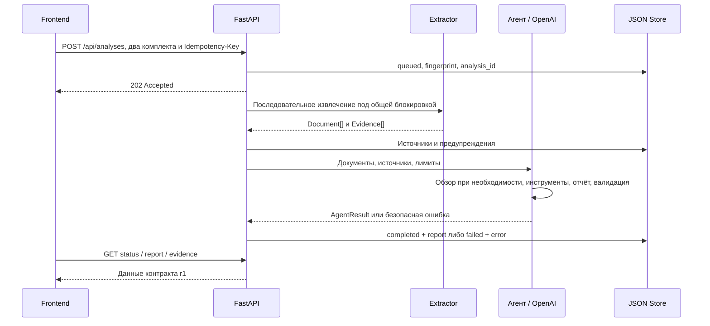

# Kontur — руководство по backend

Backend принимает два комплекта документов, извлекает текст с адресами, запускает ограниченный AI-анализ и отдаёт отчёт и источники по HTTP. Здесь выполняются реальные вызовы модели; браузер ключа не получает.

Общий сценарий, критерии хакатона и результаты команды — в [корневом README](../README.md). Интерфейс описан в [frontend/README.md](../frontend/README.md). Этот документ описывает код общей версии `b0523fd` на 23 сентября 2026 года.

## Содержание

- [Запуск](#запуск)
- [Стек и зависимости](#стек-и-зависимости)
- [Настройки и лимиты](#настройки-и-лимиты)
- [Путь запроса](#путь-запроса)
- [Извлечение и адреса источников](#извлечение-и-адреса-источников)
- [Как устроен агент](#как-устроен-агент)
- [Контракт API](#контракт-api)
- [Хранение и повторные запросы](#хранение-и-повторные-запросы)
- [Проверки](#проверки)
- [Карта кода](#карта-кода)
- [Ограничения и диагностика](#ограничения-и-диагностика)

## Запуск

**Все команды этого README выполняются из корня репозитория**, где расположена папка `backend/`.

Требуются `uv`, Python 3.11–3.13 и доступ к OpenAI для настоящего анализа. Для воспроизведения используйте Python 3.12. Набор зависимостей закреплён в [uv.lock](uv.lock); диапазоны поддерживаемых версий — в [pyproject.toml](pyproject.toml).

```sh
uv sync --project backend --locked --python 3.12
```

Создайте корневой `.env` по [../.env.example](../.env.example), не перезаписывая существующий. Внесите свой `OPENAI_API_KEY` через редактор. Затем:

```sh
uv run --project backend --locked uvicorn backend.app:app --host 127.0.0.1 --port 8000
```

Сервер запускается с одним worker. `--reload` во время живого анализа приведёт к перезапуску процесса и потере незавершённой задачи; для демонстрации используйте команду выше.

Откройте [health](http://127.0.0.1:8000/api/health) или выполните:

```sh
curl http://127.0.0.1:8000/api/health
```

Ответ содержит `status`, `contract_version`, `model`, `model_configured` и `supported_extensions`. `model_configured=true` означает наличие непустой настройки ключа. Health не делает платного запроса, не проверяет права аккаунта или его баланс.

Основной UI запускается отдельно на 5173. На [8000](http://127.0.0.1:8000) доступен резервный `static/demo.html`: загрузка, статус, отчёт и цитаты без React. Это технический интерфейс с упрощённой обработкой ожидания; его цикл опроса ограничен 150 итерациями с паузами 1,5 с. Для длинного анализа используйте основной frontend. Документация маршрутов — [Swagger UI](http://127.0.0.1:8000/docs), схема — [OpenAPI](http://127.0.0.1:8000/openapi.json).

## Стек и зависимости

Точные версии перечислены по текущему lock-файлу. Обновление диапазона в `pyproject.toml` без согласованного lock-файла не является воспроизводимым обновлением.

| Библиотека        | Версия         | Применение                                                             |
| ----------------- | -------------- | ---------------------------------------------------------------------- |
| FastAPI           | 0.141.1        | Маршруты, модели ответов, обработка ошибок, CORS и `BackgroundTasks`   |
| Uvicorn           | 0.53.0         | ASGI-сервер локального приложения                                      |
| python-multipart  | 0.0.32         | Приём повторяющихся файловых полей двух комплектов                     |
| Pydantic          | 2.13.5         | Строгие модели HTTP/агента с запретом лишних полей                     |
| python-dotenv     | 1.2.3          | Чтение корневого `.env` без вывода секретов                            |
| OpenAI Python SDK | 2.54.0         | Асинхронный Responses API, инструменты и JSON Schema                   |
| python-docx       | 1.2.0          | Абзацы и ячейки таблиц DOCX                                            |
| openpyxl          | 3.1.5          | Чтение листов/ячеек XLSX без вычисления формул                         |
| pypdf             | 6.19.0         | Текстовый слой и номера страниц PDF                                    |
| pytest / HTTPX    | 9.1.1 / 0.28.1 | Автоматические тесты и TestClient без настоящего провайдера            |
| ReportLab         | 4.5.1          | Создание контролируемых PDF в тестах; не экспорт аналитического отчёта |

Стандартная библиотека даёт `asyncio`, `difflib`, JSON, SHA-256, ZIP/XML-проверки и файловое хранение. Отдельных SQL/NoSQL, Redis, Celery, embeddings, векторного поиска, LangChain или GPU-сервиса здесь нет.

## Настройки и лимиты

### Что действительно читается из окружения

Источник — [config.py](config.py), `Settings.from_env()`.

| Параметр                  | Источник                      | По умолчанию и смысл                                                           |
| ------------------------- | ----------------------------- | ------------------------------------------------------------------------------ |
| `OPENAI_API_KEY`          | Только корневой `.env`        | Пустой; без ключа новый анализ получает 503                                    |
| `OPENAI_MODEL`            | Только корневой `.env`        | `gpt-6-luna`                                                                   |
| `OPENAI_REASONING_EFFORT` | Только корневой `.env`        | `medium`; приложение допускает `none`, `low`, `medium`, `high`, `xhigh`, `max` |
| `CORS_ORIGINS`            | Только корневой `.env`        | Дополнительные origins через запятую, без завершающего `/`                     |
| `ORG_REVIEW_DATA_DIR`     | Переменная окружения процесса | Абсолютный путь предпочтителен; иначе `outputs/analyses` от корня проекта      |

Ключ, модель и reasoning из унаследованных одноимённых переменных процесса не используются. `.env` внутри `backend/` также не читается. `ORG_REVIEW_DATA_DIR` в корневом `.env` не применяется: это именно переменная процесса.

Порты 5173, 4173, 3000 для `localhost` и `127.0.0.1` всегда включены в CORS; `CORS_ORIGINS` **добавляет** origins. Разрешены GET/POST и заголовки `Content-Type`, `Idempotency-Key`, без cookie credentials. CORS не проверяет пользователя и не блокирует все нежелательные серверные операции.

Модель вызывается через фиксированный `https://api.openai.com/v1`; переменная собственного base URL не реализована. В коде таблица расчётных ставок есть для `gpt-6-luna` и `gpt-6-sol`; другая модель останавливается как `unsupported_model`. Наличие модели/режима в коде не подтверждает доступность для конкретного ключа. Автоматического переключения провайдера нет.

### Ограничения, задаваемые кодом

Эти поля принадлежат `Settings`; одноимённые переменные `.env` автоматически их не меняют.

| Ограничение                               |                                                     Значение |
| ----------------------------------------- | -----------------------------------------------------------: |
| Файлов на сторону                         |                                                    От 1 до 5 |
| Размер файла в HTTP                       |                                         5 × 1024 × 1024 байт |
| Незавершённых заданий в хранилище         |           Максимум 2; модель обрабатывает их последовательно |
| Исходных символов в комплекте             | 250 000, сумма `quote`, без повторённого соседнего контекста |
| Запросов модели на анализ                 |                         До 6, включая обзор/сборку/коррекцию |
| Вызовов инструментов                      |                                                         До 8 |
| Максимум выходных токенов финальной части |                                                       49 152 |
| Таймаут одного модельного ответа          |                                                   480 секунд |
| Таймаут агентного анализа                 |  900 секунд; не включает очередь и предшествующее извлечение |
| Оценочный бюджет                          |                 $0.25 на анализ по локальной таблице расчёта |

Промежуточный инструментальный ответ ограничен 2048 выходными токенами при `none`, 8192 при остальных режимах; обзор — 16384, точечная коррекция цитат — 8192, также с учётом общего ограничения `max_output_tokens`. SDK настроен с `max_retries=0`. Приложение отдельно разрешает одну повторную установку соединения за анализ при `httpx.ConnectError/ConnectTimeout`, с паузой 0,5 с и в пределах таймаута. При `ReadError/RemoteProtocolError` и неизвестной причине автоматического повтора нет: предыдущий запрос мог быть обработан. Эта попытка подключения не увеличивает `usage.calls`, который считает логические обращения агента.

Ставки зашиты в `agent.py::PRICES` и используются для предварительного резерва и расчёта по `usage`. Это реализация оценки расходов, а не обещание актуального тарифа. Перед новым вызовом учитываются примерный объём истории, схем и лимит выхода; слишком большой запрос/бюджет останавливает анализ. После неопределённого сетевого сбоя стоимость может быть `null`, а не ноль. Локальный бюджет не является ограничением счёта OpenAI.

## Путь запроса



В `create_analysis()` проверяются имена/форматы, содержимое и ключ повторного запроса. Задание создаётся до фоновой обработки. `process()` берёт общий `asyncio.Lock`, читает файлы через `asyncio.to_thread`, сохраняет извлечённые источники и только потом вызывает агента.

Реальный backend выставляет `extracting` → `verifying` → `reporting`; `matching` присутствует в контракте для совместимости, но не отправляется этим обработчиком отдельным этапом. Статусы: `queued`, `running`, `completed`, `failed`. Процент готовности не вычисляется.

`coverage` формирует сервер по результатам извлечения. Если не удалось прочитать ни одного фрагмента с одной стороны, модель не запускается. Если часть документов прочитана, возможен частичный отчёт с предупреждениями. Ошибка модели не превращается в пустой «успешный» отчёт.

## Извлечение и адреса источников

[extraction.py](extraction.py) не вызывает AI и не исполняет команды документа. Оно возвращает `Document` и список `Evidence`.

| Формат | Что читается                                        | Адрес и ограничения                                                                            |
| ------ | --------------------------------------------------- | ---------------------------------------------------------------------------------------------- |
| DOCX   | Основные абзацы и ячейки таблиц в порядке документа | Заголовок секции, индекс абзаца или таблица и `R…C…`; страниц Word не выдумываем               |
| XLSX   | Непустые ячейки всех листов                         | Название листа и координата; `read_only=True`, `data_only=False`, внешние связи не сохраняются |
| PDF    | Текстовый слой страниц                              | Страница с 1 и индекс фрагмента; без OCR и восстановления графической структуры                |
| MD/TXT | UTF-8/UTF-8 BOM, абзацы по пустым строкам           | Индекс абзаца; Markdown не исполняется и не превращается в HTML                                |

Для DOCX предупреждаются текстовые колонтитулы/сноски, изображения, вложенные таблицы, исправления и встроенные блоки. Чистое поле номера страницы не считается пропущенным содержательным текстом. Объединённые ячейки не дублируются. Для XLSX сохраняется текст формулы, а не её вычисленный результат; для PDF отдельно видны пустые/ошибочные страницы и графические объекты.

`extraction_status` равен `read`, `partial` или `failed`. Наличие предупреждений делает документ частичным. Лимит, повреждение или отсутствие читаемого текста даёт явный отказ/предупреждение, а не молчаливо обрезанный успешный документ.

Внутренние защитные пределы извлечения: 15 МиБ входа при прямом вызове (HTTP строже — 5 МиБ), 40 МиБ распакованного Office, 1500 ZIP-элементов, 200 PDF-страниц, 100 000 ячеек, 10 000 фрагментов и 2 млн символов на документ. До Office-парсера проверяются распаковка, подозрительная степень сжатия, дубли ZIP-имён, шифрование и явные XML DOCTYPE/ENTITY. Это ограничивает распространённые плохие входы, но не любое потребление CPU/RAM.

### Модель Evidence

Пример серверного идентификатора: `doc-001:e00001`. Это адрес внутри одного анализа; текстовая метка вроде `[B-FUN-01]` в документе не является таким ID.

| Поле                                      | Происхождение                                                   |
| ----------------------------------------- | --------------------------------------------------------------- |
| `document_id`, `document_name`, `version` | Комплект загрузки и назначенный сервером документ               |
| `evidence_id`                             | Серверный ID по порядку извлечения                              |
| `locator`                                 | Адрес парсера: абзац, таблица, страница, лист/ячейка            |
| `quote`                                   | Точный извлечённый текст, без генерации моделью                 |
| `context`                                 | До 700 символов конца предыдущего и начала следующего фрагмента |
| `extraction_warning`                      | Предупреждение о частичном чтении документа                     |

`context.py::pack_sources()` отправляет модели каждую цитату с её ID, документом и версией в исходном порядке. Соседний контекст не многократно дублируется во входном пакете; его возвращает `read_evidence`. Исходные цитаты при этом не отбрасываются.

## Как устроен агент

### Что делает модель

Один ограниченный агент предлагает `unit_changes`, `functions`, `function_matches`, `findings`, `conclusion`. Для функций указываются действие, объект, область, роль, исполнитель, версия и источники. Модельный результат проверяется сервером; документы, названия и результаты инструментов в инструкциях обозначены как недоверенные данные.

| Инструмент         | Аргументы                                          | Результат                                                                                                             |
| ------------------ | -------------------------------------------------- | --------------------------------------------------------------------------------------------------------------------- |
| `search_functions` | `query` 2–300 символов; `version=before/after/all` | Лексическое ранжирование текущих цитат и контекста; до 12 совпадений, ID просмотренных документов, ограничения поиска |
| `read_evidence`    | `evidence_id` текущего анализа                     | Цитата, версия, адрес и соседний контекст                                                                             |

Произвольные инструменты, shell, URL или чтение пути с диска модели не предоставлены. Аргументы проверяются Pydantic; неизвестный инструмент или ID даёт безопасную ошибку. Первый инструментальный ход принудительно выбирает `search_functions`; версия `after` предписана инструкцией, а основание для `possible_loss` дополнительно проверяет код. Без успешного вызова инструмента финальный отчёт не публикуется.

### Длинные редакции

`comparison.py` применяется при не менее 100 фрагментах суммарно и одной однозначной паре документов. `SequenceMatcher(autojunk=False)` выделяет изменённые области, сохраняя повторения и контекст. Если блоков нет или на стороне несколько документов, используется общий путь без этого обзора.

Обзор классифицирует каждую заметку как `changed`, `preserved`, `uncertain` или `editorial`. Схема требует все блоки ровно один раз. Это проверка охвата промежуточного разбора, а не доказательство всех смысловых изменений внутри абзаца.

Затем заметки делятся максимум на две группы. `scoped_review_history()` оставляет для каждого прохода только его промежуточные гипотезы; полный исходный текст и результаты инструментов сохраняются. `merge_reports()` добавляет префиксы `p1-`/`p2-` к внутренним ID, переназначает ссылки и объединяет рекомендации/ограничения. Это не дополнительная семантическая дедупликация.

### Что проверяет код

- Уникальность и существование ID, версии функций и источников, непустые структурные поля.
- Включение каждой **извлечённой** функции «до» в матрицу. Это не гарантия, что модель извлекла каждую обязанность документа.
- Наследование источников по явным связям: функция → соответствие/замечание → рекомендация.
- Дословный `source_excerpt` функции в одной из её цитат. Это внутреннее поле генерации; в API r1 его нет.
- Наличие источника с точным названием подразделения той же версии, если такое название есть в извлечённом тексте. `attach_unit_name_sources()` добавляет такой адрес, сохраняя исходные ссылки; правопреемство этим не устанавливается.
- Для возможной потери: исходная функция, реальный выполненный поиск, `checked_after_document_ids`, ограничения и отсутствие противоречия с сохранённым/переданным соответствием.
- Для дубля/конфликта: минимум две функции и два относящихся к ним источника «после»; для дубля также разные подразделения.
- Рекомендации ссылаются на существующие замечания и их источники; `human_review` ответа модели остаётся `unreviewed`.

`report_format.py` по возможности ограничивает генерируемые адреса перечислением ID текущего комплекта. При превышении заложенного предела схемы используется обычное строковое поле и тот же серверный валидатор — источники не отбрасываются.

На весь анализ допускается одна коррекция: структурного отчёта либо только ошибочных `source_excerpt`. Во втором случае корректные функции/выводы не перегенерируются. `review_source_coverage` сообщает об источниках промежуточных смысловых заметок, не представленных в итоговых строках; это ограничение охвата, не подсчёт доказанных пропусков.

Журнал `activity` содержит операции, статусы и ID (`search_functions`, `read_evidence`, `review_comparison_blocks`, `attach_unit_name_sources`, `assemble_linked_citations`, `repair_source_excerpts`, `validate_references`, `review_source_coverage`, `reconnect_model`). Он не является скрытыми рассуждениями модели. `usage` формируется по ответам провайдера до разбора JSON.

## Контракт API

Публичная версия — **r1**. Источники истины: [models.py](models.py), [app.py](app.py), [API_CONTRACT.md](../API_CONTRACT.md). Примеры: [fixtures/api](../fixtures/api/README.md).

| Метод и путь                                             | Ответ и назначение                                                                  |
| -------------------------------------------------------- | ----------------------------------------------------------------------------------- |
| `GET /api/health`                                        | Конфигурация и поддерживаемые форматы без модельного вызова                         |
| `POST /api/analyses`                                     | 202, `analysis_id/status/contract_version`; multipart `before_files`, `after_files` |
| `GET /api/analyses/{analysis_id}`                        | Статус, этап, документы, предупреждения, `error`, `usage`                           |
| `GET /api/analyses/{analysis_id}/report`                 | `Report` после завершения; 409, пока готового отчёта нет                            |
| `GET /api/analyses/{analysis_id}/evidence/{evidence_id}` | Источник только из указанного анализа                                               |

У `Report` есть серверные `coverage/documents/activity/usage`, идентификатор/версия контракта и семантические разделы `ReportPayload`. Модель не владеет метаданными покрытия и оригинальными цитатами API. Схемы HTTP не включают локальные решения сотрудника.

### Запрос из терминала

Следующая команда создаёт **реальный платный анализ**, если backend настроен. Выполняйте осознанно; `expected.json` в запрос не включается.

```sh
curl -X POST http://127.0.0.1:8000/api/analyses \
  -H 'Idempotency-Key: manual-demo-001' \
  -F 'before_files=@fixtures/org-review/before.md' \
  -F 'after_files=@fixtures/org-review/after.md'
```

В Windows используйте `curl.exe` и команду одной строкой. Скопируйте возвращённый ID в запросы статуса/отчёта. GET-запросы не вызывают модель. Источник может содержать `:` в ID; HTTP-клиент должен кодировать идентификатор как один сегмент пути.

### Ошибки

```json
{
  "error": { "code": "model_not_configured", "message": "…", "retryable": true }
}
```

| HTTP | Пример причины                                                |
| ---- | ------------------------------------------------------------- |
| 400  | Неправильный multipart                                        |
| 404  | Неизвестный анализ/источник или недопустимый ID анализа       |
| 409  | Ключ уже использован с другим комплектом; либо отчёт не готов |
| 413  | Размер файла превышен                                         |
| 422  | Пустой комплект/файл, неправильное количество/расширение/ключ |
| 429  | Очередь уже содержит два незавершённых задания                |
| 503  | Ключ модели не настроен                                       |

После принятия задания ошибка парсера, текстового лимита, модели или её ответа возвращается в **HTTP 200 статуса** с `status=failed` и вложенным объектом `error`. `retryable` означает возможность осознанного повтора, а не обещание успеха. Сырые ошибки провайдера, ключи, тексты запросов и traceback пользователю не возвращаются.

## Хранение и повторные запросы

[storage.py](storage.py) хранит по одному JSON на анализ. ID — 32 шестнадцатеричных символа; произвольные пути не принимаются. Запись выполняется через временный файл и `replace`, доступ защищён `threading.RLock` внутри процесса.

В записи находятся статус, документы, извлечённые источники, отчёт/ошибка, usage, idempotency key и fingerprint. Последние два не возвращаются через публичный статус. Исходные бинарные файлы не сохраняются самим Store; извлечённый текст сохраняется и может быть чувствительным.

Fingerprint — SHA-256 от версии, имени и содержимого каждого файла с длинами частей. Порядок файлов тоже влияет на отпечаток. Одинаковый `Idempotency-Key` и отпечаток возвращают существующее задание, включая завершённое/неудачное; другой комплект с тем же ключом получает 409. Для нового анализа после `failed` нужен новый ключ. Без ключа каждый POST создаёт отдельное задание.

При старте `recover_interrupted()` помечает оставшиеся `queued/running` как `failed` с `analysis_interrupted`. Выполнение не возобновляется: бинарные входы не сохранены. Завершённые отчёты продолжают читаться по ID. Список истории, удаление, серверная отмена и API решений сотрудника отсутствуют. Автоматического TTL нет.

Эта архитектура рассчитана на один процесс. Межпроцессного lock, общей очереди и транзакционной БД нет; `--workers 2` не является поддерживаемым способом масштабирования.

## Проверки

```sh
uv run --project backend --locked python -m pytest backend/tests -q -p no:cacheprovider
```

На текущей версии **102 проверки**. Модель/провайдер подменены; реальные ключи и платные обращения для тестов не нужны. TestClient проверяет настоящее приложение, извлечение и хранилище на временных данных. Проверка в документации — Python 3.12 с зависимостями из lock-файла; независимая чистая установка на каждой ОС отдельно не утверждается.

| Файл тестов             | Что покрывает                                                                              |
| ----------------------- | ------------------------------------------------------------------------------------------ |
| `test_extraction.py`    | DOCX/XLSX/PDF, точные адреса, порядок, формулы, частичное чтение, повреждения и лимиты     |
| `test_context.py`       | Привязка ID к цитате, сохранение всех фрагментов, подсчёт исходного текста                 |
| `test_comparison.py`    | Текстовые блоки, вставки/удаления, охват, разделение проходов без потери полных источников |
| `test_report_format.py` | Схема адресов и ограничения размера перечислений                                           |
| `test_agent.py`         | Инструменты, ссылки, бюджет/таймаут, коррекция, usage и ограниченный повтор подключения    |
| `test_api.py`           | Загрузка, отчёт, источники, повтор, `.env`, восстановление после перезапуска               |
| `test_http_contract.py` | Ошибки, очередь, CORS, health и точность сохранённой OpenAPI-схемы                         |
| `test_contract.py`      | Соответствие общих HTTP-примеров моделям ответа                                            |

Обновить общие HTTP-примеры без вызова модели:

```sh
uv run --project backend --locked python -m backend.export_contract
```

Команда **перезаписывает** `fixtures/api/*.json`: проверьте diff и затем выполните контрактные тесты. Генератор использует временное хранилище и тестовый агент. Эти JSON — материалы разработки frontend, а не отчёт реального AI.

Смысловая приёмка выполняется отдельно: загрузить только два документа, дождаться результата, после этого сравнить с эталоном и проверить цитаты. Последние измерения команды: 5/5 на авторском комплекте и 6/6 выбранных изменений на одной реальной паре DOCX; подробные границы — [INTEGRATION_RESULTS.md](../docs/INTEGRATION_RESULTS.md). Автоматические 102 теста не означают 102 подтверждения качества модели.

## Карта кода

| Файл                                     | Главные точки входа и ответственность                                                              |
| ---------------------------------------- | -------------------------------------------------------------------------------------------------- |
| [app.py](app.py)                         | `create_app`, `create_analysis`, `process`: маршруты, очередь, покрытие и безопасные ошибки        |
| [config.py](config.py)                   | `Settings`, `from_env`: настройки, лимиты, CORS                                                    |
| [models.py](models.py)                   | `Document`, `Evidence`, `ReportPayload`, `Report`, `AnalysisStatus`, `Usage`                       |
| [extraction.py](extraction.py)           | `extract_document`, парсеры форматов и защитные ограничения                                        |
| [context.py](context.py)                 | `pack_sources`, `source_characters`: пакет исходников модели                                       |
| [comparison.py](comparison.py)           | `comparison_blocks`, `validate_review`, `scoped_review_history`, `review_batches`, `merge_reports` |
| [agent.py](agent.py)                     | `run_agent`, `_Run`, два инструмента, модельные вызовы и `validate_payload`                        |
| [report_format.py](report_format.py)     | `report_schema`: ограничения адресов в схеме генерации                                             |
| [storage.py](storage.py)                 | `Store`: JSON, локальный lock, восстановление состояний                                            |
| [export_contract.py](export_contract.py) | Генератор OpenAPI и HTTP-фикстур с подменой модели                                                 |
| [static/demo.html](static/demo.html)     | Резервный простой интерфейс диагностики                                                            |
| `tests/`                                 | Механическая проверка без сети провайдера                                                          |

Для первого знакомства: `models.py` → HTTP-маршруты → извлечение → `pack_sources` → `_Run.execute` → `validate_payload` → хранение → соответствующий тест.

При добавлении формата обновляйте парсер, `SUPPORTED_EXTENSIONS`, лимиты, frontend `ACCEPT/validateFiles`, подсказки и тесты. При изменении контракта обновляйте Python-модели, Zod, `API_CONTRACT.md`, генератор/фикстуры и UI вместе. При смене модели отдельно проверяйте формат ответа, reasoning, расходы и смысловую приёмку; нельзя принимать доступность строки конфигурации за проверенную интеграцию.

## Ограничения и диагностика

Непрочитанный документ и не найденное назначение функции — разные состояния. Нет OCR, внешнего веб-поиска, проверки законодательства, эталонной оргструктуры и гарантии полного реестра. Слияния/разделения представлены схемой, но должны подтверждаться исходными документами. Валидация адресов не доказывает смысл замечания.

Для публичного использования остаются нерешёнными: аутентификация и проверка доступа к анализам, ранний предел всего HTTP-тела, ограничение частоты и общего бюджета, изоляция времени/памяти парсеров, жизненный цикл чувствительных результатов, многопроцессная очередь. Текущий локальный запуск на `127.0.0.1` не следует описывать как готовую корпоративную платформу.

Типовые причины `failed`: `no_readable_text`, `text_limit`, `model_timeout`, `cost_limit`, `unsupported_model`, `invalid_model_output`, `analysis_interrupted`. Начните с статуса, предупреждений документов и конфигурации; не публикуйте реальные JSON-результаты и `.env` в issue/Git. Если сломался именно формат API, сначала проверьте контрактные тесты; если потерян смысл при правильных цитатах — нужен контрольный пример качества, а не изменение парсера без доказательств.
