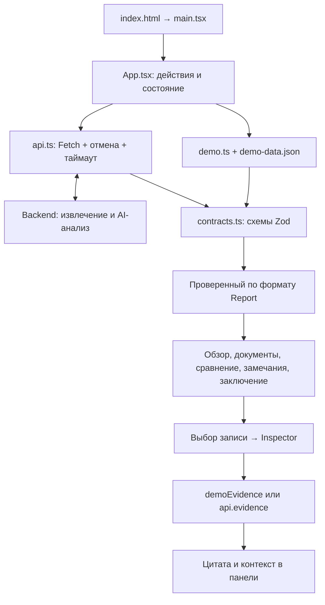

# Kontur — руководство по frontend

Kontur — organizational intelligence: веб-интерфейс команды Amazing Guys / HackAlem для проверки организационных изменений.
Пользователь загружает документы **до** и **после** реорганизации, изучает сопоставление функций
и подразделений, проверяет замечания по источникам и читает заключение. Извлечение документов
и AI-анализ выполняет backend; frontend отвечает за взаимодействие с пользователем и отображение результата.
Код интерфейса находится в `frontend/` общей ветки `main`.

## Навигация по руководству

- [Быстрый запуск](#быстрый-запуск)
- [Экраны и функции](#экраны-и-функции)
- [Технологии](#технологии)
- [Как взаимодействуют части приложения](#как-взаимодействуют-части-приложения)
- [Подключение к backend](#подключение-к-backend)
- [Карта файлов](#карта-файлов)
- [Где менять нужную функцию](#где-менять-нужную-функцию)
- [Команды и проверки](#команды-и-проверки)
- [Текущие ограничения](#текущие-ограничения)

## Быстрый запуск

Требуются Node.js **22.12+** и npm. Из корня репозитория:

```sh
cd frontend
npm ci
npm run dev
```

Откройте [http://127.0.0.1:5173](http://127.0.0.1:5173). Нажмите **«Открыть пример»**
либо сразу выберите раздел слева: в деморежиме он откроется с готовыми данными.
Для этого не нужны Python, backend или ключ модели.

Деморежим показывает **авторский пример, не результат AI**. Его документы находятся
в [fixtures/org-review](../fixtures/org-review/), данные интерфейса — в
[src/demo-data.json](src/demo-data.json), доступные для просмотра исходники — в
[public/demo](public/demo/). Выбранные пользователем файлы в деморежиме не отправляются
и не анализируются. После перезагрузки страницы отчёт и выбор файлов сбрасываются.

В блоке **«Сценарий демонстрации»** можно выбрать полный пример, неполное покрытие,
сбой или пустой результат. Прямое открытие раздела без отчёта использует полный пример;
для остальных состояний выберите сценарий и нажмите «Открыть пример».

## Экраны и функции

| Раздел          | Содержимое и действия                                                                                                       |
| --------------- | --------------------------------------------------------------------------------------------------------------------------- |
| Новое сравнение | Выбор или перетаскивание файлов в комплекты «до» и «после», удаление лишних, запуск серверного анализа или открытие примера |
| Обзор           | Показатели текущего отчёта, охват проверки, основные замечания, переход к сравнению и источникам, выгрузка результата       |
| Документы       | Список документов, статусы чтения, предупреждения о частично прочитанных и непрочитанных файлах                             |
| Сравнение       | Три вкладки: матрица функций, изменения подразделений, реестр функций; поиск, фильтры и источники записей                   |
| Замечания       | Возможные потери и дубли, потенциальные конфликты и недостаток данных; поиск, фильтр типа, основания и ограничения вывода   |
| Заключение      | Итоговый текст, ограничения, рекомендации с источниками, журнал операций и выгрузка отчёта                                  |

В режиме «Сервер» без полученного отчёта разделы предлагают загрузить документы
или явно переключиться на демопример.

### Гостевой вход

Кнопка **«Войти»** справа сверху открывает окно с единственным вариантом
**«Войти как гость»**. После короткой загрузки (0,7 с) окно закрывается,
а кнопка меняется на **«Гость»**. Текущий экран и выбранные файлы сохраняются.
Повторное нажатие позволяет продолжить работу; Escape или крестик отменяют ожидание.

Гостевой флаг хранится в `sessionStorage` до завершения сессии вкладки.
При недоступном хранилище вход работает в памяти текущей страницы.
Это локальный гостевой режим, **не серверная авторизация и не защита API**:
аккаунт и токен не создаются, запросов для входа нет. Просмотр разделов остаётся
доступным без входа; переключатель «Демо / Сервер» по-прежнему выбирает источник данных.

### Панель источников и анимации

При выборе записи справа открывается `Inspector`: версия документа, адрес фрагмента,
цитата из ответа, раскрываемый контекст и предупреждения извлечения. Цитату можно
скопировать. В деморежиме доступны исходные `before.pdf` и `after.pdf`; для реальных документов
интерфейс показывает цитату и контекст, предоставленные API.

Выбранная запись подсвечивается. На телефоне панель открывается поверх страницы,
а фокус клавиатуры остаётся внутри неё. Escape закрывает панель и возвращает фокус
к последней выбранной записи. При смене источника старый запрос отменяется.

Разделы и вкладки переключаются с коротким переходом, панель плавно открывается
и закрывается. Во время ожидания источников появляются спиннер и скелетоны,
при ошибке — объяснение и повтор загрузки. Полученные источники показываются сразу.
Настройка `prefers-reduced-motion` отключает анимации и переходы.
Таблицы на узких экранах имеют собственную горизонтальную прокрутку.

### Состояния загрузки

- После выбора файлов в каждом комплекте на 0,5 с показывается «Подготовка файлов…».
  Это обратная связь о локальном выборе после проверки расширения, размера и количества;
  содержимое документов браузер не анализирует. Сравнение доступно после подготовки обоих комплектов.
- При сравнении окно со спиннером показывает отправку файлов, очередь и текущий этап сервера.
  Результат открывается только после получения и проверки отчёта, с коротким переходом 0,4 с.
  Продолжительность самого анализа зависит от backend; интерфейс не подменяет его готовым примером.
- «Остановить ожидание» работает и при открытии результата. Файлы сохраняются;
  повтор продолжает работу с принятым анализом без повторной отправки документов.
- При экспорте обе кнопки показывают «Готовим отчёт…» на 0,35 с и блокируют повторный запуск.
  Источники загружаются со спиннером до ответа API, гостевой вход — с коротким ожиданием 0,7 с.

Состояния доступны скринридеру; при reduced motion вращение отключено, текст ожидания остаётся.
Переключение вкладок, поиск и фильтры не получают искусственной задержки.

### Выгрузка: текущее поведение кнопки

**Кнопка называется «Скачать отчёт PDF», но сейчас сохраняет JSON.** Изменена только
подпись; генерация PDF ещё не реализована. Это известное несоответствие названия
и действия, которое нужно учитывать при демонстрации.

Функция `exportReport()` сохраняет текущий `Report` и поле `provenance` через
браузерный `Blob`, без отдельного запроса к серверу. Имя файла:
`org-review-<analysis_id>.json`, для демопримера — с префиксом `DEMO-`.
В файл входят данные отчёта и идентификаторы источников; отдельно загруженные в панели
цитаты в него не добавляются. Фильтры экрана не сокращают экспортируемый отчёт.

## Технологии

Состав зависимостей указан в [package.json](package.json), точные установленные
версии закреплены в [package-lock.json](package-lock.json).

| Технология                       | Роль и взаимодействие с остальным кодом                                                                                          |
| -------------------------------- | -------------------------------------------------------------------------------------------------------------------------------- |
| React 19                         | Компоненты, состояние, обработка действий; `main.tsx` монтирует `App`, хуки управляют файлами, отчётом, навигацией и источниками |
| TypeScript                       | Проверка типов при разработке и сборке; компоненты и HTTP-клиент используют типы из `contracts.ts`                               |
| Vite + React plugin              | Локальный сервер, обновление интерфейса при правках, production-сборка TSX/CSS/шрифтов и обработка `VITE_API_BASE_URL`           |
| Zod                              | Проверка демоданных и ответов API до отображения; из схем выводятся TypeScript-типы                                              |
| Lucide React                     | SVG-иконки, подключённые непосредственно в компонентах                                                                           |
| Golos Text через `@fontsource`   | Локальный шрифт; начертания 400/500/600/700 импортируются в `main.tsx`                                                           |
| Обычный CSS                      | Цвета, сетки, таблицы, адаптивность, состояния и CSS-анимации в `styles.css`                                                     |
| Web Animations API               | Закрытие панели источников; `Inspector` дожидается конца анимации и отменяет её при выборе другой записи                         |
| Fetch, AbortController, FormData | HTTP-запросы, отмена и передача файлов в `api.ts`; запуском управляет `App`                                                      |
| Playwright + axe                 | Браузерные сценарии и автоматическая проверка доступности с авторскими данными и HTTP-подменами                                  |
| Prettier                         | Единое форматирование файлов через `npm run format`                                                                              |

Отдельного роутера, Redux, библиотеки UI-компонентов и библиотеки анимаций здесь нет.
Навигация хранится в состоянии React: разделы не имеют собственных URL.

## Как взаимодействуют части приложения



`main.tsx` подключает шрифт и стили, включает `React.StrictMode` и оборачивает
приложение в `ErrorBoundary`. При ошибке рендера пользователь видит экран восстановления.

`App.tsx` содержит основную логику и компоненты `UploadBox`, `Inspector`, `Badge`,
`Alert`, `Empty`. Сейчас экраны находятся в этом же файле, а не в отдельных папках страниц.
Полезные ориентиры в состоянии:

| Значение                             | За что отвечает                                                                       |
| ------------------------------------ | ------------------------------------------------------------------------------------- |
| `mode`                               | Режим следующего запуска: демо или сервер                                             |
| `reportMode`                         | Происхождение уже полученного отчёта; определяет подписи и способ загрузки источников |
| `view`, `tab`                        | Текущий раздел и вкладка сравнения                                                    |
| `files`                              | Два массива выбранных файлов: `before` и `after`                                      |
| `report`                             | Проверенный схемой отчёт, из которого строятся экраны и показатели                    |
| `selection`                          | Выбранная запись и её `evidence_ids` для панели источников                            |
| `query`, `filter`                    | Поиск и фильтр текущего раздела                                                       |
| `busy`, `stage`, `progress`, `error` | Ход обработки и ошибки                                                                |

`requestKey`, `analysisId` и `controller` хранятся в refs: они позволяют продолжать
ожидание анализа, повторять запрос с тем же ключом и отменять ожидание.
Отчёт и выбранные файлы живут в памяти вкладки; localStorage и база данных на frontend
не используются. Только флаг гостевого режима сохраняется в sessionStorage.

Показатели и таблицы формируются из `report`. Схемы Zod проверяют структуру ответа,
но не доказывают правильность смысловых выводов — для этого пользователь открывает источники.

## Подключение к backend

1. Запустите backend по [его README](../backend/README.md).
2. При необходимости создайте `.env.local` в папке `frontend`:

   ```sh
   cp .env.example .env.local
   ```

   ```dotenv
   VITE_API_BASE_URL=http://127.0.0.1:8000
   ```

3. После изменения адреса перезапустите Vite; для production заново выполните сборку.
4. В интерфейсе выберите **«Сервер»**, добавьте хотя бы один файл в каждый комплект
   и нажмите **«Сравнить документы»**.

`VITE_API_BASE_URL` — публичный адрес API. Переменные `VITE_*` попадают в клиентскую
сборку: ключи модели и другие секреты должны оставаться на backend.
По умолчанию backend разрешает локальные origins `localhost` и `127.0.0.1`
на портах 5173, 4173 и 3000. Для другого origin настройте серверный CORS;
странице, открытой по HTTPS, нужен доступный по HTTPS API.

### Обмен данными

Frontend использует контракт [r1](../API_CONTRACT.md).

| Шаг      | Метод и путь                                    | Результат                                                                                                               |
| -------- | ----------------------------------------------- | ----------------------------------------------------------------------------------------------------------------------- |
| Запуск   | `POST /api/analyses`                            | `analysis_id`; файлы передаются как multipart-поля `before_files` и `after_files`, ключ — в заголовке `Idempotency-Key` |
| Ожидание | `GET /api/analyses/{id}`                        | Состояние `queued`, `running`, `completed` или `failed`, этап и предупреждения                                          |
| Отчёт    | `GET /api/analyses/{id}/report`                 | Функции, соответствия, изменения подразделений, замечания, заключение и охват                                           |
| Источник | `GET /api/analyses/{id}/evidence/{evidence_id}` | Цитата, контекст и адрес фрагмента выбранной записи                                                                     |

После запуска `runApi()` проверяет статус с паузой 1,4 секунды между итерациями.
Предельное ожидание — 10 минут, сетевой таймаут отдельного запроса — 30 секунд.
Этапы: чтение документов → сопоставление → проверка источников → подготовка заключения.
Если сервер сообщает `completed`, но отчёт ещё возвращает `409`, ожидание продолжается.

При сетевой ошибке повтор использует прежний ключ и выбранные файлы; если ID анализа
уже известен, продолжается проверка статуса. После явного `failed` следующий запуск
создаёт новый анализ. **«Остановить ожидание» прекращает запросы браузера, но не отменяет
серверную задачу**: endpoint отмены в r1 отсутствует.

До отправки проверяются расширение, непустой файл, максимум **5 файлов на комплект**
и **5 МиБ на файл**. Поддерживаются PDF, DOCX, XLSX, TXT и MD. Проверка расширения
не гарантирует читаемость содержимого: извлечение и его ограничения определяет backend.
DOC/XLS нужно преобразовать; OCR не реализован.

## Карта файлов

```text
frontend/
├── index.html                 # HTML-точка входа
├── package.json               # Зависимости и npm-команды
├── package-lock.json          # Зафиксированные версии зависимостей
├── vite.config.ts             # React plugin, порты 5173 и 4173
├── tsconfig.json              # Строгая проверка TypeScript
├── playwright.config.ts       # Браузер, тестовый сервер, traces при сбое
├── .env.example               # Пример публичного адреса backend
├── .gitignore                 # Исключения для локальных и сборочных файлов
├── src/
│   ├── components/GuestAccess.tsx # Окно гостевого входа и состояние сессии
│   ├── main.tsx               # Монтирование, шрифты, ErrorBoundary
│   ├── App.tsx                # Экраны, состояние, запуск анализа, экспорт
│   ├── styles.css             # Внешний вид, адаптивность, анимации
│   ├── contracts.ts           # Zod-схемы, типы, подписи и цвета статусов
│   ├── api.ts                 # HTTP-клиент и проверка выбранных файлов
│   ├── demo.ts                # Подготовка демосценариев
│   └── demo-data.json         # Авторский отчёт и цитаты
├── public/
│   ├── favicon.svg            # Значок вкладки
│   └── demo/                  # before.pdf и after.pdf; Markdown-версии для редактирования и проверки цитат
├── tests/frontend.spec.ts     # Браузерные проверки основного сценария
├── tests/guest.spec.ts        # Гостевой вход, отмена, фокус и доступность
├── tests/loading.spec.ts      # Подготовка файлов, отмена результата и защита экспорта от повторов
└── docs/                      # Результаты проверок и снимки интерфейса
```

`node_modules/`, `dist/`, `test-results/`, `playwright-report/` и `.env.local`
создаются локально и не коммитятся.

## Где менять нужную функцию

| Задача                                            | Где искать                                                                                                                                                                     |
| ------------------------------------------------- | ------------------------------------------------------------------------------------------------------------------------------------------------------------------------------ |
| Изменить текст, кнопку или содержимое экрана      | [App.tsx](src/App.tsx): массив `nav`, `viewNames` и блоки `view === ...`                                                                                                       |
| Добавить раздел                                   | Тип `View`, навигация, `openSection()` / `navigate()` и соответствующий блок рендера в `App.tsx`                                                                               |
| Изменить загрузку файлов                          | `UploadBox` в `App.tsx`; `ACCEPT`, `MAX_SIZE`, `validateFiles()` в [api.ts](src/api.ts); серверные лимиты согласовать с backend                                                |
| Изменить запуск, повтор или ожидание              | `runApi()`, `cancel()`, `changeFiles()` в `App.tsx`                                                                                                                            |
| Изменить адреса или обработку HTTP-ошибок         | `request()` и объект `api` в `api.ts`                                                                                                                                          |
| Добавить поле ответа или новый статус             | Сначала согласовать [API_CONTRACT.md](../API_CONTRACT.md) и [backend/models.py](../backend/models.py), затем обновить [contracts.ts](src/contracts.ts), отображение и фикстуры |
| Изменить панель источников                        | `Inspector` в `App.tsx`; классы `.inspector`, `.source-*`, `.evidence-*` в [styles.css](src/styles.css)                                                                        |
| Изменить цвета, отступы или поведение на телефоне | `styles.css`: CSS-переменные и блоки `@media`                                                                                                                                  |
| Изменить анимации                                 | CSS keyframes, `prefers-reduced-motion` и функция `dismiss()` внутри `Inspector`                                                                                               |
| Обновить демопример                               | [demo-data.json](src/demo-data.json), [demo.ts](src/demo.ts) и исходники [public/demo](public/demo/); цитаты должны совпадать с исходным текстом                               |
| Реализовать настоящий PDF-экспорт                 | `exportReport()` и `download()` в `App.tsx`, обе кнопки экспорта и проверка выгрузки в тестах                                                                                  |
| Проверить пользовательский сценарий               | [tests/frontend.spec.ts](tests/frontend.spec.ts); HTTP-фикстуры — [fixtures/api](../fixtures/api/)                                                                             |

Для первого знакомства удобно читать в таком порядке:
`main.tsx` → типы `Report` / `Selection` в `contracts.ts` → состояние и обработчики
в `App.tsx` → `api.ts` → нужный экран и его CSS → соответствующий браузерный тест.

## Команды и проверки

Все команды ниже выполняются из `frontend/`.

| Команда           | Что делает                                                 |
| ----------------- | ---------------------------------------------------------- |
| `npm ci`          | Устанавливает зависимости по lock-файлу                    |
| `npm run dev`     | Запускает Vite на `127.0.0.1:5173`                         |
| `npm run build`   | Проверяет TypeScript и создаёт статические файлы в `dist/` |
| `npm run preview` | Показывает уже собранный `dist/` на `127.0.0.1:4173`       |
| `npm test`        | Запускает браузерные проверки Playwright                   |
| `npm run format`  | Форматирует файлы фронтенда через Prettier                 |

Для тестов нужен браузер. Можно установить Chromium:

```sh
npx playwright install chromium
npm test
```

Или использовать установленный Google Chrome:

```sh
PLAYWRIGHT_CHANNEL=chrome npm test
```

Запуск только основного сценария, включая выгрузку:

```sh
PLAYWRIGHT_CHANNEL=chrome npm test -- --grep 'demo journey'
```

Playwright использует существующий Vite на 5173 или запускает его автоматически.
Порты заданы со `strictPort`: занятый порт не заменяется другим незаметно.
API в тестах перехватывается: документы и вызовы модели на реальный backend не уходят.
Проверяются навигация, фильтры, точность демоцитат, выгрузка JSON, ограничения файлов,
ошибки и пустые состояния, multipart, polling, повторные запросы, источники,
мобильная вёрстка, фокус, reduced motion и доступность через axe.

В наборе 28 проверок, включая гостевой вход, состояния загрузки и работу при недоступном sessionStorage.
[Отчёт о проверках и скриншоты](docs/VERIFICATION.md) фиксирует результаты прогонов.
Автоматическая проверка доступности не заменяет ручную.
Результаты запуска с настоящим backend/AI и ограничения качества анализа описаны
отдельно в [INTEGRATION_RESULTS.md](../docs/INTEGRATION_RESULTS.md).

## Текущие ограничения

- Генерации PDF пока нет; кнопка с подписью PDF сохраняет JSON, как описано выше.
- Нет истории анализов между сессиями, серверной авторизации, чата, редактирования документов
  и сохранения отметок сотрудника о проверке замечаний.
- Нет встроенного просмотра полного PDF и скачивания оригинала из API:
  текущий контракт предоставляет цитату и контекст, а не оригинальный файл.
- Frontend не извлекает текст документов и не вызывает модель напрямую.
  Наличие источника не гарантирует полноту анализа или правильность вывода.
- Демопример служит для проверки интерфейса; его эталонные данные не отправляются модели.

Дизайн и код подготовлены с Codex. ImageGen-макет использовался как визуальный ориентир;
цитаты из изображения не переносились в приложение. Шрифты поставляются локально,
внешние CDN и аналитика не используются.
