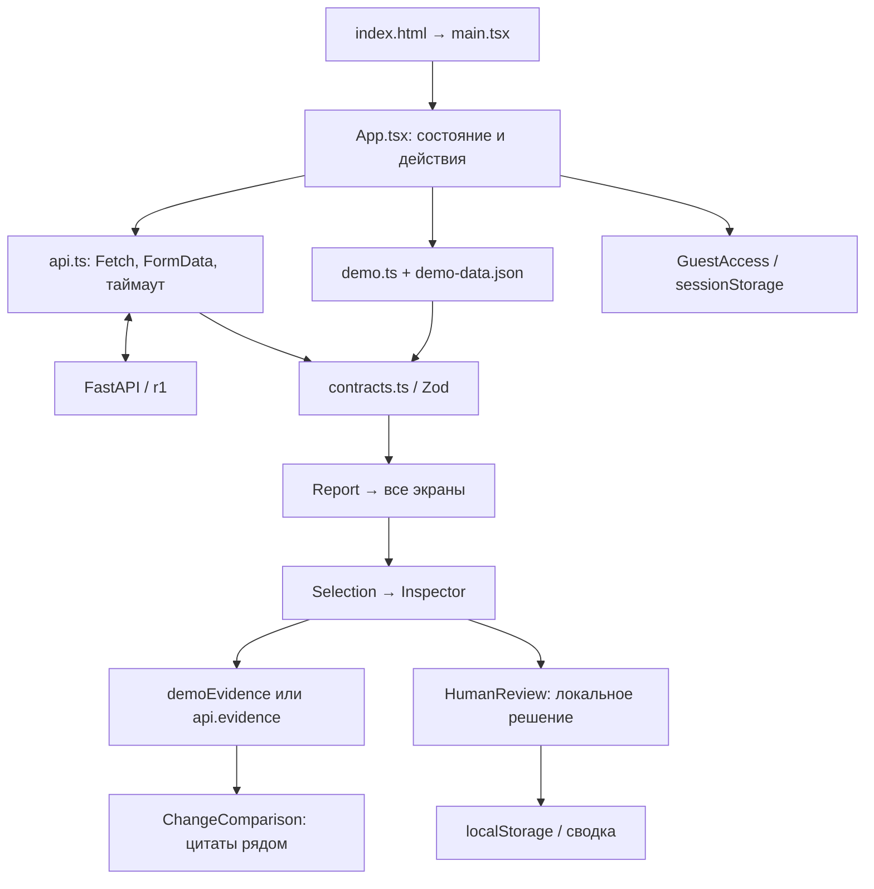

# Kontur — руководство по frontend

**Kontur — organizational intelligence** — интерфейс проверки организационных изменений. Пользователь загружает документы «до» и «после», изучает функции/подразделения, проверяет источники и сохраняет локальное решение по замечанию. Извлечение документов и модельный анализ выполняет backend; frontend показывает проверенный по формату ответ.

Общие инструкции и критерии оценки: [README репозитория](../README.md). Реальный сервер: [backend/README.md](../backend/README.md). Описание соответствует объединённому коду `b0523fd` на 23 сентября 2026 года, включая гостевой вход, ожидание, PDF-исходники демо, сравнение цитат и решения сотрудника.

## Содержание

- [Быстрый запуск](#быстрый-запуск)
- [Экраны и пользовательский сценарий](#экраны-и-пользовательский-сценарий)
- [Источники и сравнение цитат](#источники-и-сравнение-цитат)
- [Гостевой вход и решения сотрудника](#гостевой-вход-и-решения-сотрудника)
- [Демо и экспорт](#демо-и-экспорт)
- [Технологии](#технологии)
- [Устройство приложения](#устройство-приложения)
- [Подключение к backend](#подключение-к-backend)
- [Ожидание, ошибки и повтор](#ожидание-ошибки-и-повтор)
- [Карта кода и точки изменений](#карта-кода-и-точки-изменений)
- [Проверки и команды](#проверки-и-команды)
- [Ограничения и вклад в критерии](#ограничения-и-вклад-в-критерии)

## Быстрый запуск

Нужны Node.js **22.12+** и npm. Из корня репозитория:

```sh
cd frontend
npm ci
npm run dev
```

Откройте [http://127.0.0.1:5173](http://127.0.0.1:5173). «Открыть пример» и все пять разделов навигации работают в деморежиме без Python, ключа и запущенного backend. При первом открытии раздела автоматически подставляется полный авторский пример.

Для настоящего анализа запустите backend по [инструкции](../backend/README.md), затем переключитесь с «Демо» на **«Сервер»**, выберите файлы обеих версий и нажмите **«Сравнить документы»**. В режиме сервера пустой раздел предлагает начать анализ или явно посмотреть демопример; ошибка сервера не подменяется готовым демо.

### Сборка и окружение

Из `frontend/`:

```sh
npm run build
npm run preview
```

Сборка создаёт `dist/`, preview работает на [127.0.0.1:4173](http://127.0.0.1:4173). Порты фиксированы с `strictPort`; если порт занят, сервер завершится с ошибкой вместо незаметной смены адреса.

Адрес backend по умолчанию — `http://127.0.0.1:8000`. Для изменения создайте `.env.local` из [.env.example](.env.example), сохранив существующий файл:

```dotenv
VITE_API_BASE_URL=http://127.0.0.1:8000
```

После изменения перезапустите Vite, а для `dist/` выполните новую сборку. Все `VITE_*` публичны: ключ OpenAI туда не помещается. Vite не проксирует API — браузер обращается к этому адресу напрямую. При размещении frontend на другом компьютере `127.0.0.1` означает компьютер посетителя, а не сервер команды.

## Экраны и пользовательский сценарий

| Экран           | Что видно                                                                           | Основные действия                                                                |
| --------------- | ----------------------------------------------------------------------------------- | -------------------------------------------------------------------------------- |
| Новое сравнение | Две области «До изменений» / «После изменений», файлы, лимиты, режим и демокарточка | Выбрать/перетащить документы, удалить файл, запустить сравнение или пример       |
| Обзор           | Показатели отчёта, документы, охват, заметные изменения и замечания                 | Перейти к сравнению/источникам, скачать JSON                                     |
| Документы       | Состав обеих версий, `read/partial/failed`, предупреждения                          | Проверить полноту чтения; в демо открыть `before.pdf` и `after.pdf`              |
| Сравнение       | Матрица функций, изменения подразделений, реестр функций                            | Переключать вкладки, искать, фильтровать, открывать цитаты и сравнивать их рядом |
| Замечания       | Потери, дубли, потенциальные конфликты и недостаток данных                          | Фильтр/поиск, «Проверить основания», локальное решение и сводка проверок         |
| Заключение      | Сводка, ограничения, рекомендации, состав отчёта, журнал операций                   | Проверять источники рекомендаций, скачать JSON                                   |

Отображаемые статусы берутся из [contracts.ts](src/contracts.ts). Цвет — вспомогательный сигнал, рядом есть текст. `unresolved` означает неустановленное соответствие; `possible_loss` — возможное отсутствие назначения в предоставленном комплекте, а не доказанное отсутствие функции в организации.

Строка может иметь функции только «после»; она не должна автоматически объявляться доказанно новой обязанностью. Сохранённые функции тоже показываются. Поиск и фильтры работают локально над текущим отчётом, без дополнительных вызовов модели.

### Короткий маршрут демонстрации

1. Откройте авторский пример и проверьте имена PDF в полосе документов.
2. В «Сравнении» найдите перенос/изменение, откройте «Источники» и **«Сравнить цитаты рядом»**.
3. Посмотрите точный фрагмент, контекст и объяснение. Подсветка слов сама по себе не подтверждает смысловой вывод.
4. В «Замечаниях» откройте основания, выберите решение сотрудника и сохраните комментарий.
5. В «Заключении» проверьте ограничения и скачайте JSON. Для настоящего анализа повторите маршрут в режиме «Сервер» на собственных документах.

## Источники и сравнение цитат

`Inspector` внутри [App.tsx](src/App.tsx) получает `Selection` с идентификаторами источников. В демо используется `demoEvidence`; при реальном анализе выполняется `api.evidence()` для каждого уникального ID. Панель показывает файл, версию, адрес, дословную цитату, соседний контекст и предупреждение извлечения. Копирование использует Clipboard API; при отказе браузера есть сообщение о ручном копировании.

Пока запрос не завершён, показываются спиннер/скелетоны. Старые цитаты скрываются при смене записи. `AbortController` отменяет устаревший запрос, а ключ выбранных источников не даёт подставить запоздавший результат к новой записи. При ошибке есть повтор загрузки.

Фокус возвращается к выбранной записи; Escape закрывает панель. На телефоне она открывается поверх страницы с удержанием фокуса клавиатуры. Закрытие через Web Animations API можно отменить при новом выборе. `prefers-reduced-motion` отключает вращение и переходы, сохраняя текст ожидания.

### Карточка «До и после по источникам»

[ChangeComparison.tsx](src/ChangeComparison.tsx) получает **уже загруженные** `Evidence[]` и `function_match`, без дополнительного запроса модели. Переключатель доступен для строки матрицы; обычный просмотр цитат сохраняется.

- С одной цитатой каждой версии запускается локальное сравнение токенов по LCS. Кириллица, пробелы и переносы строк сохраняются в тексте.
- Удалённые и добавленные части выделяются через React `<mark>`; пользовательский HTML не исполняется.
- С несколькими источниками на любой стороне автоматическое попарное соответствие не угадывается: выводятся точные фрагменты без подсветки.
- При более 1600 токенах с одной стороны или произведении размеров более 320 000 ячеек сравнения также показывается исходный текст с пояснением.
- Отсутствующая сторона явно обозначается. Каждая цитата имеет адрес, раскрываемый контекст и предупреждение.

Это механическая подсветка **двух цитат**, а не сравнение всей структуры файлов и не новый смысловой анализ. Серверный обзор блоков в `backend/comparison.py` — другой механизм, работающий до формирования отчёта.

## Гостевой вход и решения сотрудника

### «Войти как гость»

[components/GuestAccess.tsx](src/components/GuestAccess.tsx) открывает нативный `<dialog>` через portal в `document.body`. Единственный вариант первого входа — гость. После перехода длительностью 0,7 с кнопка становится «Гость»; текущие документы и экран сохраняются. Повторное открытие предлагает продолжить работу.

Гостевой флаг `kontur.guest=active` хранится в `sessionStorage`. При недоступном хранилище работает состояние React. Escape, крестик и нажатие вне окна отменяют незавершённый переход. Фокус переносится на основное действие и возвращается на кнопку входа.

Это локальное состояние интерфейса: запросов входа, аккаунта и токена нет. Разделы доступны и без него; backend не получает подтверждения личности.

### Проверка сотрудником

[HumanReview.tsx](src/HumanReview.tsx) открывается в панели замечания и хранит данные отдельно от исходного `Report`.

| Решение         | Значение              |
| --------------- | --------------------- |
| Не проверено    | `unreviewed`          |
| Подтверждено    | `confirmed`           |
| Отклонено       | `rejected`            |
| Нужно уточнение | `needs_clarification` |

Комментарий ограничен 1000 символами. После **«Сохранить решение»** записываются `decision`, `comment`, `updatedAt`; изменение радиокнопки без сохранения считается черновиком и явно помечается. Есть сброс, сообщения о повреждённых данных/недоступном хранилище и об ошибке записи. Неудачное сохранение не объявляется успешным.

Ключ localStorage состоит из префикса `kontur:human-review:v1`, `analysis_id`, `finding_id` и сегмента версии. Компонент поддерживает необязательный `reportFingerprint`, но текущий `App` его не передаёт, поэтому последний сегмент — `current`. Это изоляция по анализу/замечанию, а не вычисленный криптографический отпечаток отчёта.

`HumanReviewSummaryView` показывает сводку всех замечаний текущего отчёта, включая скрытые фильтром. Обновление в текущей вкладке идёт через custom event, в других вкладках того же origin — через `storage`. Серверной синхронизации нет. `localhost` и `127.0.0.1` — разные origins и имеют разные локальные записи.

Ответ API продолжает содержать `human_review=unreviewed`. Решения не меняют модельный вывод, не включаются в JSON-экспорт и исчезают при очистке localStorage. Отчёт и выбранные файлы после перезагрузки не восстанавливаются, хотя решение можно снова увидеть при открытии того же анализа/демопримера. Не сохраняйте в комментариях сведения, которые нельзя оставлять в этом браузере.

## Демо и экспорт

### Какие данные использует демо

[demo-data.json](src/demo-data.json) содержит авторский отчёт и словарь цитат; [demo.ts](src/demo.ts) проверяет схемы и создаёт четыре состояния:

| Сценарий   | Поведение                                                                                                   |
| ---------- | ----------------------------------------------------------------------------------------------------------- |
| `complete` | Полный подготовленный пример                                                                                |
| `partial`  | Добавляется непрочитанное приложение и предупреждения; потенциальная потеря заменяется на недостаток данных |
| `failed`   | Демонстрация ошибки без выдуманного успешного отчёта                                                        |
| `empty`    | Пустые списки и объяснение неполноты                                                                        |

Сценарии выбираются на стартовом экране; прямое открытие раздела до первого отчёта использует полный пример. Выбранные пользователем файлы в демо не отправляются и не влияют на готовый результат.

Исходники для пользователя — [before.pdf](public/demo/before.pdf) и [after.pdf](public/demo/after.pdf). Это настоящие PDF авторского комплекта. Рядом оставлены Markdown-версии для редактирования и проверки цитат. Семантический эталон находится в [fixtures/org-review](../fixtures/org-review/README.md); небольшие HTTP-фикстуры — в [fixtures/api](../fixtures/api/README.md). Это три разных назначения, не взаимозаменяемые «результаты AI».

### Что скачивается

Кнопка текущей объединённой версии называется **«Скачать отчёт JSON»**. `exportReport()` создаёт `Blob` из текущего `Report` и добавляет поле `provenance`:

- `DEMO-org-review-<analysis_id>.json` — заранее подготовленный пример;
- `org-review-<analysis_id>.json` — ответ backend.

Поиск и фильтры не сокращают файл. Отдельно загруженные цитаты панели и локальные решения сотрудника не добавляются. Во время подготовки обе кнопки блокируются общим состоянием и ref-защитой, поэтому быстрые нажатия не создают несколько скачиваний. Генерация PDF-отчёта отсутствует; PDF-исходники демо не являются таким отчётом.

## Технологии

Версии взяты из [package-lock.json](package-lock.json); [package.json](package.json) задаёт зависимости и команды.

| Технология                         | Версия          | Зачем используется                                                        |
| ---------------------------------- | --------------- | ------------------------------------------------------------------------- |
| React / React DOM                  | 19.3.0          | Компоненты, события, состояние, portal и монтирование                     |
| TypeScript                         | 7.0.2           | Строгие типы; `Report`, `Evidence`, `Selection` связывают UI и клиент API |
| Vite                               | 7.3.6           | Dev-сервер, React plugin, переменные `VITE_*`, сборка TSX/CSS/шрифтов     |
| Zod                                | 4.6.5           | Проверка демоданных и HTTP-ответов до показа, вывод TypeScript-типов      |
| Lucide React                       | 1.47.0          | SVG-иконки, используемые в компонентах                                    |
| `@fontsource/golos-text`           | 5.3.0           | Локальные начертания 400/500/600/700 без внешнего CDN                     |
| Обычный CSS / Web Animations API   | Браузер         | Макет, адаптивность, спиннеры, переходы и управляемое закрытие панели     |
| Fetch / FormData / AbortController | Браузер         | Прямое HTTP-взаимодействие, multipart, таймаут и отмена                   |
| Playwright / axe                   | 1.63.0 / 4.13.0 | Браузерные сценарии, мобильная вёрстка и автоматическая доступность       |
| Prettier                           | 3.9.9           | Форматирование                                                            |

React Router, Redux, Tailwind и отдельной библиотеки анимаций нет. Навигация — состояние React, а не маршруты URL; deep links на отчёт/раздел не реализованы. Локальная подсветка цитат не требует внешней diff-библиотеки.

## Устройство приложения



`main.tsx` подключает шрифты/CSS и `React.StrictMode`. `ErrorBoundary` при ошибке рендера показывает восстановление страницы; это не подмена обработки HTTP-ошибок.

Большинство экранов и компонентов (`UploadBox`, `Inspector`, `ExportButton`, `Badge`, `Alert`, `Empty`) находятся в одном `App.tsx`. Вспомогательные функции выделены в отдельные модули; скрытой папки страниц или глобального store нет.

| Состояние / ref                                       | За что отвечает                                                               |
| ----------------------------------------------------- | ----------------------------------------------------------------------------- |
| `mode` / `reportMode`                                 | Режим следующего запуска / происхождение уже полученного отчёта; не смешивать |
| `view`, `tab`                                         | Раздел и вкладка сравнения                                                    |
| `files`, `preparingFiles`                             | Файлы двух версий и краткая локальная подготовка                              |
| `report`, `selection`                                 | Общие данные и выбранная строка с `evidence_ids`                              |
| `query`, `filter`                                     | Поиск и фильтр текущего раздела                                               |
| `busy`, `phase`, `stage`, `progress`, `error`         | Отправка/анализ/открытие результата и серверные состояния                     |
| `requestKey`, `analysisId`, `controller`, `busyRef`   | Идемпотентный повтор, опрос того же анализа, отмена и защита запуска          |
| `exporting`, `exportController`                       | Одна операция выгрузки при двух кнопках                                       |
| `sourceKey`, `loadedKey`, `compareQuotes` в Inspector | Соответствие ответа текущей записи и режим сравнения цитат                    |

`navigate()` сбрасывает выбор источника, поиск, фильтр и мобильное меню. Схемы Zod проверяют формат ответа, а не правильность смысловой связи; бизнес-проверки источников выполняет backend, итоговую содержательную оценку — сотрудник.

## Подключение к backend

Frontend использует [API_CONTRACT.md, r1](../API_CONTRACT.md). [api.ts](src/api.ts) содержит `request()` и методы `start/status/report/evidence`; backend по умолчанию разрешает CORS для localhost/127.0.0.1 на 5173, 4173, 3000.

| Действие         | HTTP                                            | Что проверяет/передаёт клиент                                                 |
| ---------------- | ----------------------------------------------- | ----------------------------------------------------------------------------- |
| Создать анализ   | `POST /api/analyses`                            | Повторяющиеся multipart-поля `before_files`, `after_files`; `Idempotency-Key` |
| Опросить         | `GET /api/analyses/{id}`                        | Состояние, этап, документы, ошибки и предупреждения                           |
| Получить отчёт   | `GET /api/analyses/{id}/report`                 | Полный `Report` по схеме Zod                                                  |
| Открыть источник | `GET /api/analyses/{id}/evidence/{evidence_id}` | Версия, файл, адрес, цитата и контекст; сегменты URL кодируются               |

`request()` разбирает серверный `{error:{code,message,retryable}}`, показывает безопасное сообщение и не рендерит ответ неправильной схемы. Автоматического fallback на демо при ошибке API нет.

Перед отправкой проверяются расширение, размер, непустой файл, максимум 5 файлов на сторону и 5 МиБ на файл. Допустимы `.pdf`, `.docx`, `.xlsx`, `.txt`, `.md`; PDF не требуется переименовывать в Markdown. Проверка расширения не подтверждает читаемость содержимого. DOC/XLS, сканы и изображения требуют отдельной обработки вне текущего frontend.

Изменения Python-схем нужно согласовать с `contracts.ts` и фикстурами. TypeScript-типы выводятся из Zod, но Python и TypeScript не генерируются друг из друга автоматически. Совместимость поддерживается общими примерами и тестами.

## Ожидание, ошибки и повтор

| Операция         | Что видит пользователь                  | Реальная граница                                                                       |
| ---------------- | --------------------------------------- | -------------------------------------------------------------------------------------- |
| Выбор файлов     | «Подготовка файлов…», 0,5 с             | Короткая обратная связь после локальной проверки; чтение содержимого выполняет backend |
| POST             | «Отправляем документы»                  | Ожидание принятия файлов сервером                                                      |
| Опрос            | Очередь/текущий этап и вращение         | Ответы backend; выдуманного процента нет                                               |
| Получение отчёта | «Открываем результат», переход 0,4 с    | Загрузка после `completed`; показ результата — после проверки ответа                   |
| Источники        | Спиннер, скелетоны, затем точные цитаты | До реального ответа; готовые источники не задерживаются                                |
| Экспорт          | «Готовим отчёт…», 0,35 с                | Локальное создание JSON, без модели                                                    |
| Гость            | «Открываем пространство…», 0,7 с        | Локальный переход без авторизации API                                                  |

`runApi()` опрашивает статус с паузой 1,4 с между итерациями. Предельное ожидание после принятия задания — 16 минут; отдельный сетевой запрос имеет таймаут 30 с. Время очереди/извлечения сервера может отличаться от его 900-секундного агентного таймаута.

Сервер текущей версии отправляет `extracting/verifying/reporting`; `matching` поддерживается контрактом и демонстрацией. Если статус уже `completed`, но отчёт отвечает 409, клиент продолжает ожидание. Неизвестный формат или серверный `failed` показывается как ошибка.

- Повтор после сетевого сбоя использует прежний `Idempotency-Key`; с известным ID продолжается опрос без повторного POST.
- После явного `failed` ID/ключ сбрасываются: следующий запуск — новый анализ.
- Смена файлов сбрасывает ID/ключ, потому что изменился комплект.
- «Остановить ожидание» отменяет клиентский запрос/таймер, но не серверную задачу: endpoint отмены отсутствует.
- Выбранные файлы остаются в памяти до перезагрузки страницы. Во время обработки фоновые элементы недоступны, повторные запуски блокируются.

Разделы, поиск и фильтры не получают искусственную задержку. Reduced motion отключает CSS/JS-эффекты, но оставляет текстовые состояния. Короткие интервалы обратной связи не ограничивают время анализа сервера.

## Карта кода и точки изменений

```text
frontend/
├── index.html                      HTML и название вкладки
├── package.json / package-lock.json зависимости и npm-команды
├── vite.config.ts                  React plugin и фиксированные порты
├── tsconfig.json                   strict TypeScript
├── playwright.config.ts            браузер, сервер, traces/screenshot при ошибке
├── .env.example                    публичный адрес API
├── src/
│   ├── main.tsx                    шрифты, StrictMode, ErrorBoundary
│   ├── App.tsx                     экраны, загрузка, Inspector, запуск и экспорт
│   ├── api.ts                      HTTP, AbortController, валидация файлов
│   ├── contracts.ts                Zod, типы, русские подписи, оформление статусов
│   ├── demo.ts / demo-data.json     готовый пример и четыре сценария
│   ├── components/GuestAccess.tsx  гостевой диалог
│   ├── ChangeComparison.tsx        две колонки источников и ограниченный LCS
│   ├── HumanReview.tsx             локальное решение, хук и сводка
│   ├── styles.css                  основные стили и адаптивность
│   ├── change-comparison.css       оформление сравнения цитат
│   ├── comparison-integration.css  расширение Inspector для двух колонок
│   └── human-review.css            форма решения и сводка
├── public/demo/                    PDF-исходники и редактируемые Markdown
├── tests/                          пять файлов браузерных проверок
└── docs/                           записи проверок и исторические снимки
```

| Что изменить                | Где искать                                                                                                     |
| --------------------------- | -------------------------------------------------------------------------------------------------------------- |
| Название продукта           | Brand в `App.tsx`, `GuestAccess.tsx`, `<title>` в `index.html`                                                 |
| Раздел/подпись/показатель   | `View`, `nav`, `viewNames`, `openSection`, `navigate`, ветки рендера `App.tsx`                                 |
| Загрузка и лимиты           | `UploadBox`, `changeFiles`, `api.ts::validateFiles`; согласовать backend                                       |
| Анализ, повтор, отмена      | `runApi`, `runDemo`, `cancel`, refs ключа и ID                                                                 |
| Экспорт                     | `ExportButton`, `exportReport`, `download`; обе кнопки используют общую функцию                                |
| Адреса/схемы HTTP           | `api.ts`, `contracts.ts`, Python-модели и общие фикстуры                                                       |
| Источники и их открытие     | `Inspector`, `Selection`, `locationLabel`, `sourceKey`                                                         |
| Подсветка отличий           | `ChangeComparison::diffText`, ограничения токенов/матрицы, CSS компонента                                      |
| Решения/сводка              | `HumanReview`, `useHumanReview`, `HumanReviewSummaryView`; не менять исходный `Report` ради локального статуса |
| Гостевой вход               | `GuestAccess`, sessionStorage, native dialog                                                                   |
| Цвета/адаптивность/анимации | Основной CSS и три дополнительных CSS; `@media`, reduced motion, `dismiss()`                                   |
| Авторский пример            | `demo-data.json`, `demo.ts`, PDF/MD и эталон; цитаты должны оставаться согласованы                             |

Порядок чтения: `main.tsx` → `contracts.ts` → состояние/обработчики `App.tsx` → `api.ts` → нужный экран/компонент → его CSS → тест сценария. `node_modules`, `dist`, `.env.local`, `test-results` и `playwright-report` создаются локально и исключены из Git.

## Проверки и команды

Все команды этого раздела — из `frontend/`.

| Команда           | Действие                                                              |
| ----------------- | --------------------------------------------------------------------- |
| `npm ci`          | Установка строго по lock-файлу                                        |
| `npm run dev`     | Vite на 127.0.0.1:5173                                                |
| `npm run build`   | `tsc -b` и production-сборка Vite                                     |
| `npm run preview` | Локальный просмотр `dist/` на 4173                                    |
| `npm test`        | Playwright                                                            |
| `npm run format`  | Форматирование frontend через Prettier; проверьте diff перед коммитом |

Для новой установки:

```sh
npx playwright install chromium
npm test
```

На Linux могут потребоваться системные библиотеки браузера: `npx playwright install --with-deps chromium`. Для уже установленного Google Chrome:

```sh
PLAYWRIGHT_CHANNEL=chrome npm test
```

В PowerShell: `$env:PLAYWRIGHT_CHANNEL="chrome"; npm test`.

| Файл                              | Число сценариев | Проверяемое поведение                                                                                     |
| --------------------------------- | --------------: | --------------------------------------------------------------------------------------------------------- |
| `tests/frontend.spec.ts`          |              22 | Основной путь, пять разделов, цитаты, фильтры, JSON, плохой ввод, ошибки/повтор API, мобильный экран, axe |
| `tests/guest.spec.ts`             |               3 | Вход/отмена, фокус, файлы, недоступный sessionStorage                                                     |
| `tests/loading.spec.ts`           |               3 | Подготовка, отмена открытия результата, повтор без второго POST, единичный экспорт                        |
| `tests/change-comparison.spec.ts` |               3 | Точные пробелы/кириллица, несколько источников, большие цитаты, мобильная ширина                          |
| `tests/human-review.spec.ts`      |               4 | Сохранение/восстановление, черновик, изоляция анализов, отказ хранилища и сброс                           |
| **Всего**                         |          **35** | Автоматические сценарии интерфейса, не метрика AI                                                         |

Playwright использует два worker, поднимает Vite либо использует существующий сервер на 5173. Ответы API перехватываются тестами, провайдер не вызывается. Конфигурация сохраняет trace/screenshot при ошибке. Два вспомогательных снимка в `loading.spec.ts` сейчас записываются в `/private/tmp`; для переноса набора на другую ОС может понадобиться изменить только эти пути на доступный временный каталог.

На общей версии 23 сентября повторно прошли **35 тестов** (Chrome, 49,8 с). История предыдущих прогонов и снимков — [docs/VERIFICATION.md](docs/VERIFICATION.md), свежая общая приёмка — [INTEGRATION_RESULTS.md](../docs/INTEGRATION_RESULTS.md). Старые снимки могут показывать прежние подписи. Axe не заменяет ручной аудит всех экранов и вспомогательных технологий.

## Ограничения и вклад в критерии

Frontend обеспечивает загрузку и просмотр пяти результатов из ТЗ, работу с точными основаниями и понятную диагностику. [Критерии и расхождение шкал](../README.md#оценка-хакатона) описаны в общем README, чтобы веса не дублировались с разными значениями в технических руководствах.

Для демонстрации значимы полный путь до результата, читаемые источники, явное неполное покрытие и воспроизводимый запуск. Гостевой вход, анимации, подсветка и локальная проверка — дополнительные удобства; они не доказывают правильность модели.

Нет PDF-экспорта отчёта, серверной авторизации/хранения решений, истории анализов в интерфейсе, deep links, встроенного просмотра оригинала реального документа, чата и редактирования документов. Реальные оригиналы через API не скачиваются; demo PDF открываются как статические файлы. Backend-анализ не происходит в браузере, API-ключ не нужен frontend.

Тексты и комментарии выводятся как текст React; `dangerouslySetInnerHTML` для документов не используется. Это не полная защита системы: ограничения доступа и загрузки относятся также к backend. Код и оформление готовились с Codex; ImageGen-макет служил визуальным ориентиром. Шрифты локальные, внешние CDN и аналитика не подключены.
